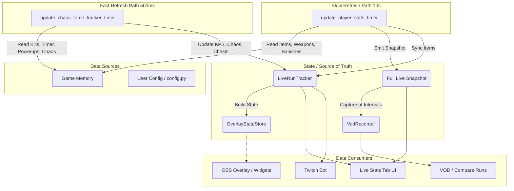

# BonkScanner Data Flow Architecture

## 1. Introduction

- **Why this document exists:** To provide a structural overview of the data pipelines in the BonkScanner / MegabonkReroll project. It helps developers understand where data originates, how often it is updated, where the state is stored, and who consumes it.
- **What it describes:** Data sources, refresh loops (fast vs. slow), state repositories, and data consumers.
- **How to read it:** Follow the flow from Raw Sources -> Updaters -> State Stores -> Consumers. Reference the architecture diagram and the summary table for quick lookups.

## 2. Data Sources (Raw Sources)

For each feature, the data begins its journey here.

- **Game Memory / Memory Readers**
  - **What it is:** Direct memory reading of the target game process.
  - **Code location:** `src/memory.py`, `src/gui_player_stats.py` (e.g., `_get_player_stats_client()`).
  - **Data extracted:** Player stats (luck, damage), run timer, mob kills, items, weapons, chaos tome level, expected chest inputs, powerup tracking snapshots, banishes.
- **Config / User Config**
  - **What it is:** Configuration settings read from disk or defined at runtime.
  - **Code location:** `src/config.py` (`OVERLAY`, `TWITCH_BOT`, etc.).
  - **Data extracted:** Refresh intervals (`PLAYER_STATS_REFRESH_MS`, `CHAOS_TOME_TRACKER_INTERVAL_MS`), overlay tracked item rules, Twitch bot commands.
- **Runtime-derived Values**
  - **What it is:** Values calculated dynamically based on raw memory data over time.
  - **Code location:** `src/live_run_tracker.py`, `src/run_summary.py`.
  - **Data extracted:** Kills per Second (KPS), stage summaries, RPM (rerolls per minute).
- **VOD Snapshots**
  - **What it is:** Saved JSON records of completed runs.
  - **Code location:** `src/vod_storage.py`.
  - **Data extracted:** Full historical snapshots for the Compare Runs UI.

## 3. Updaters / Refresh Loops

This section defines the active logic that pulls from data sources and pushes to state stores. (See *Activation / Gating Rules* for trigger conditions).

- **Slow Full Live Stats Refresh**
  - **Code location:** `src/gui_player_stats.py` (`update_player_stats_timer`)
  - **Updates:** Full live snapshot including items, weapons, banishes, and general player stats.
  - **Cadence:** Every 10 seconds (`PLAYER_STATS_REFRESH_MS`).
  - **Destination:** Emits full live snapshots, updates LiveRunTracker with stage transitions and item updates.
- **Fast KPS, Chaos, and Powerup Refresh**
  - **Code location:** `src/gui_player_stats.py` (`update_chaos_tome_tracker_timer`, `refresh_chaos_tome_tracker_now`)
  - **Updates:** Kills, run timer, Chaos Tome modifiers, Powerup snapshots, Chest counters.
  - **Cadence:** Every 500 ms (`CHAOS_TOME_TRACKER_INTERVAL_MS`).
  - **Destination:** Directly pushes data into `LiveRunTracker`.
- **Overlay State Updates**
  - **Code location:** `src/gui_overlay.py` (`update_overlay_state_from_tracker`)
  - **Updates:** Rebuilds the combined JSON payload for the web-based OBS overlay.
  - **Cadence:** On-demand after fast or slow refreshes.
  - **Destination:** `OverlayStateStore`.
- **VOD Snapshot Capture**
  - **Code location:** `src/gui_player_stats.py` -> `src/vod_storage.py`
  - **Updates:** Records historical run states for later review.
  - **Cadence:** Configurable, typically every 30 seconds (`PLAYER_STATS_RECORD_INTERVAL_SECONDS`).
- **Twitch Bot Command Read Path**
  - **Code location:** `src/twitch_bot.py`
  - **Updates:** Pulls stats directly from the state stores to respond to chat.
  - **Cadence:** Asynchronous socket loop, on-demand.

## 4. Activation / Gating Rules

Refresh loops do not always pull data just because their timers are running. To save resources, they are guarded by specific consumers.

- **Slow Loop Activation:** The slow 10s timer actively pulls from memory if **any** of the following is true:
  - The "Live Stats" tab is visually active.
  - VOD Recording is actively armed or running.
  - OBS Overlay is enabled and running.
  - Twitch Bot is active.
- **Fast Loop Activation:** The 500ms timer runs under the same conditions as the slow loop.
- **KPS Consumer Gating (Inside the Fast Loop):** Even when the fast loop fires, the expensive memory reads for `run_timer` and `mob_kills` are skipped unless a consumer explicitly needs them. They ONLY advance if:
  - The "Live Stats" tab is visually active, OR
  - The specific KPS widget in the OBS overlay is enabled, OR
  - The Twitch bot is active AND the `!kps` command is enabled.

## 5. State Stores / Source of Truth

This describes where the most authoritative version of the data lives.

- **LiveRunTracker (`src/live_run_tracker.py`)**
  - **What it stores:** Tracks dynamic runtime metrics: kills history, fast-moving KPS, Chaos Tome state, Powerup mapping, chest open/purchased logic, and custom tracked items.
  - **Source of truth for:** Fast-refresh features, historical kills/KPS timeline, stage-specific context.
- **Full Live Snapshot (in-memory variables in `gui_player_stats.py`)**
  - **What it stores:** The heavy payload read every 10 seconds (complete item list, weapons, banishes, stage transitions).
  - **Source of truth for:** Slow-moving heavy data fields that don't need real-time visualization.
- **OverlayStateStore (`src/overlay_state.py`)**
  - **What it stores:** The exact JSON dictionary representation of the overlay UI, derived from LiveRunTracker.
  - **Source of truth for:** HTTP clients (OBS).
- **VodRecorder (`src/vod_storage.py`)**
  - **What it stores:** Serialized historical snapshots of runs on disk.
  - **Source of truth for:** The "Compare Runs" tab and the "VODs" list.

## 6. Data Consumers

This defines who is reading the data at the end of the pipeline.

- **Live Stats Tab** (`src/gui_player_stats.py`)
  - **Reads:** `LiveRunTracker` (for KPS/Chaos/Powerups) and direct memory snapshots (for Items/Banishes/Weapons).
  - **Cadence:** Updated directly by the GUI loops (500ms / 10s).
- **OBS Overlay / Widgets** (`src/overlay_server.py`)
  - **Reads:** `OverlayStateStore` (via HTTP endpoints).
  - **Cadence:** Clients poll the HTTP server via GET requests to `/api/overlay-state` (no WebSockets or Server-Sent Events).
- **Twitch Bot** (`src/twitch_bot.py`)
  - **Reads:** Primarily `LiveRunTracker` and `config.TWITCH_BOT`.
  - **Cadence:** On-demand when a user types a command in chat.
- **Recordings / Compare Runs** (`src/gui_app.py`, `src/gui_player_stats.py`)
  - **Reads:** `VodRecorder` snapshots.
  - **Cadence:** Interactive user inspection.

## 7. Metric / Feature Tracking Matrix

| Metric / Feature | Raw Source | Updater / Refresh Path | Transport Poll Interval | Data Freshness | State Owner | Consumers |
|------------------|------------|------------------------|-------------------------|----------------|-------------|-----------|
| KPS | Game memory | Fast KPS refresh | 500 ms | 500 ms | LiveRunTracker | Live Stats, Overlay, Twitch bot |
| Mob kills | Game memory | Fast KPS refresh | 500 ms | 500 ms | LiveRunTracker | Live Stats, Overlay, VOD (stale if KPS path gated) |
| Run timer | Game memory | Fast KPS refresh | 500 ms | 500 ms | LiveRunTracker | Live Stats, Overlay, VOD, Twitch bot (stale if KPS path gated) |
| Player stats | Game memory | Slow full refresh | 10 s | 10 s | Full live snapshot | Live Stats, Overlay, VOD |
| Tracked items | Game memory | Slow full refresh | 10 s | 10 s | LiveRunTracker | Live Stats, Overlay |
| Stage summary | Derived | Slow full refresh | 10 s | 10 s | Full live snapshot | Live Stats, Compare Runs |
| Banishes | Game memory | Slow full refresh | 10 s | 10 s | Full live snapshot | Live Stats |
| Chaos tome | Game memory | Fast Chaos refresh | 500 ms | 500 ms | LiveRunTracker | Live Stats, Overlay, Twitch bot |
| Powerups | Game memory | Fast Powerup refresh | 500 ms | 500 ms | LiveRunTracker | Live Stats |
| Chest counters | Game memory | Fast Chest refresh | 500 ms | 500 ms | LiveRunTracker | Live Stats |
| VOD snapshot data| In-memory | VodRecorder interval | ~30 s | 30 s | VodRecorder | VOD list, Compare Runs |
| Overlay widget data | LiveRunTracker | Overlay state builder | ~500 ms (HTTP GET) | Mixed (500ms - 10s depending on field) | OverlayStateStore | OBS overlay / Widgets |

## 8. Current Architectural Observations

- **Clear Fast/Slow Separation:** The architecture successfully splits heavy memory reads (Items/Weapons) into a 10s slow lane and fast-moving metrics (KPS/Timer/Kills) into a 500ms fast lane. This minimizes game-process read overhead.
- **LiveRunTracker Evolution:** `LiveRunTracker` is naturally evolving into the primary state owner for all runtime derived logic.
- **Blurred Boundaries:** The boundary between what lives strictly in the "Slow Full Snapshot" lane versus what is aggregated into `LiveRunTracker` can occasionally be blurred (e.g., Tracked Items, Stage Summary).
- **Needs Confirmation:** Whether the Twitch Bot needs to pull any data from the slow lane, or if it naturally gets all required data by reading strictly from `LiveRunTracker` snapshots.

## 9. Known Gaps / Current Exceptions

Note that this document outlines the target mental model, but reality contains some pragmatic exceptions:

- **VOD Snapshot Stale KPS:** Because VOD recording triggers on a 30s interval but does NOT ungate the fast 500ms KPS memory reads, the VOD snapshots will record stale (or `None`) values for `mob_kills` and `run_timer` if the user is passively recording without having Live Stats, the Twitch bot, or the KPS overlay widget active.
- **Mixed Freshness in Overlay:** The OBS clients poll the `/api/overlay-state` endpoint every 500ms. However, only the KPS/Chaos widgets actually contain 500ms-fresh data. The player stats (Luck, Damage) and Items widgets only change their underlying values every 10 seconds due to the slow refresh path.

## 10. Suggested Future Maintenance Rule

When adding a new realtime feature, developers should immediately define:
- **Raw source:** Is it derived logic or direct memory read?
- **Updater cadence:** Can it be updated every 10s (slow lane) or does it need 500ms updates (fast lane)?
- **Gating logic:** Does it need a specific consumer to be active before reading from memory?
- **State owner:** Should it be tracked in `LiveRunTracker` (accumulated state) or just read statelessly into the live snapshot?
- **Consumers:** Will this be used by OBS, Twitch Bot, or just the local UI?
