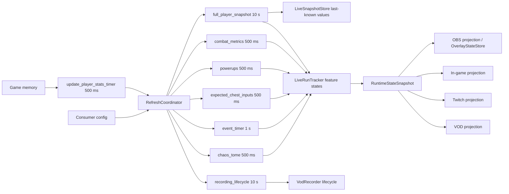
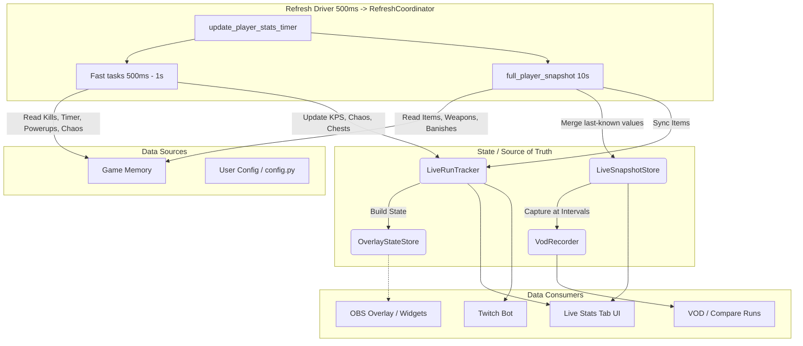

# BonkScanner Data Flow Architecture

## Current Architecture

This section is authoritative. The historical sections below are retained for
feature references and will be consolidated later.

```mermaid
flowchart LR
    Memory[Game memory] --> Driver[update_player_stats_timer 500 ms]
    Driver --> Coordinator[RefreshCoordinator]
    Config[Consumer config] --> Coordinator
    Coordinator --> Lifecycle[recording_lifecycle 10 s]
    Coordinator --> Slow[full_player_snapshot 10 s]
    Coordinator --> Combat[combat_metrics 500 ms]
    Coordinator --> Powerups[powerups 500 ms]
    Coordinator --> Chests[expected_chest_inputs 500 ms]
    Coordinator --> Event[event_timer 1 s]
    Coordinator --> Chaos[chaos_tome 500 ms]
    Slow --> Store[LiveSnapshotStore last-known values]
    Slow --> Tracker[LiveRunTracker feature states]
    Combat --> Tracker
    Powerups --> Tracker
    Chests --> Tracker
    Event --> Tracker
    Chaos --> Tracker
    Lifecycle --> Recorder[VodRecorder lifecycle]
    Tracker --> Snapshot[RuntimeStateSnapshot]
    Snapshot --> OBS[OBS projection / OverlayStateStore]
    Snapshot --> InGame[In-game projection]
    Snapshot --> Twitch[Twitch projection]
    Snapshot --> VOD[VOD projection]
```

- **One driver.** `update_player_stats_timer` is the only refresh timer; it ticks
  the coordinator every `FAST_TRACKER_INTERVAL_MS` and does nothing else. Every
  cadence in the diagram above comes from a task's `interval_ms`, never from a
  timer. A second 10 s timer used to exist and ran the recording lifecycle from
  its callback body; that work is the `recording_lifecycle` task now, which is
  why collapsing the timers did not run it 20x more often.
- `RefreshCoordinator` runs on the GUI owner thread and creates one shared
  `RefreshTickContext` per tick. Owner-dependent fast tasks resolve
  `owner_stats` at most once in that tick.
- Tasks are gated by `required`, but `recording_lifecycle` is unconditional: it
  auto-stops a recording whose game has gone away, so it cannot be gated on
  consumer demand.
- Tasks are demand-gated: OBS requires a running local server and an enabled
  widget; in-game overlay requires an enabled runtime widget; Twitch requires
  a connected bot and enabled command; VOD requires recording.
- `LiveRunTracker` is the single runtime source of truth. Its private state is
  grouped into run, combat, chest, Chaos Tome, powerup, tracked-item and
  availability feature states.
- `RuntimeStateSnapshot` is the only production read boundary for OBS,
  in-game overlay and Twitch. Consumers do not read game memory or mutate
  tracker state.
- The slow task preserves the existing 10-second full player snapshot and
  stage-summary cadence. Actual chest bought/purchased counters stay on that
  slow path; VOD capture keeps its existing effective 10-second minimum.
- `GAME_OVER` marks a completed run and preserves its last local snapshot
  until a confirmed new run starts.

## 1. Introduction

- **Why this document exists:** To provide a structural overview of the data pipelines in the BonkScanner / MegabonkReroll project. It helps developers understand where data originates, how often it is updated, where the state is stored, and who consumes it.
- **What it describes:** Data sources, refresh loops (fast vs. slow), state repositories, and data consumers.
- **How to read it:** Follow the flow from Raw Sources -> Updaters -> State Stores -> Consumers. Reference the architecture diagram and the summary table for quick lookups.

```mermaid
flowchart TD
    %% Sources
    subgraph Sources [Data Sources]
        GM[Game Memory]
        CFG[User Config / config.py]
    end

    %% Single driver, per-task cadence
    subgraph Refresh [Refresh Driver 500ms -> RefreshCoordinator]
        Driver[update_player_stats_timer]
        Fast[Fast tasks 500ms - 1s]
        Slow[full_player_snapshot 10s]
        Driver --> Fast
        Driver --> Slow
        Fast -->|Read Kills, Timer, Powerups, Chaos| GM
        Slow -->|Read Items, Weapons, Banishes| GM
    end

    %% State Owners
    subgraph StateOwners [State / Source of Truth]
        LRT(LiveRunTracker)
        FLS(LiveSnapshotStore)
        OS(OverlayStateStore)
        VODR(VodRecorder)
    end

    Fast -->|Update KPS, Chaos, Chests| LRT
    Slow -->|Merge last-known values| FLS
    Slow -->|Sync Items| LRT
    LRT -->|Build State| OS
    FLS -->|Capture at Intervals| VODR

    %% Consumers
    subgraph Consumers [Data Consumers]
        UI[Live Stats Tab UI]
        OBS[OBS Overlay / Widgets]
        TB[Twitch Bot]
        VODC[VOD / Compare Runs]
    end

    FLS --> UI
    LRT --> UI
    LRT --> TB
    OS -.-> OBS
    VODR --> VODC
```

## 2. Data Sources (Raw Sources)

For each feature, the data begins its journey here.

- **Game Memory / Memory Readers**
  - **What it is:** Direct memory reading of the target game process.
  - **Code location:** `src/infra/memory/reader.py`, `src/gui_player_stats.py` (e.g., `_get_player_stats_client()`).
  - **Data extracted:** Player stats (luck, damage), run timer, mob kills, items, weapons, chaos tome level, expected chest inputs, powerup tracking snapshots, banishes.
- **Config / User Config**
  - **What it is:** Configuration settings read from disk or defined at runtime.
  - **Code location:** `src/app/config.py` (`OVERLAY`, `TWITCH_BOT`, etc.).
  - **Data extracted:** Refresh intervals (`PLAYER_STATS_REFRESH_MS`, `FAST_TRACKER_INTERVAL_MS`), overlay tracked item rules, Twitch bot commands.
- **Runtime-derived Values**
  - **What it is:** Values calculated dynamically based on raw memory data over time.
  - **Code location:** `src/live_run_tracker.py`, `src/core/run_summary.py`.
  - **Data extracted:** Kills per Second (KPS), stage summaries, RPM (rerolls per minute).
- **VOD Snapshots**
  - **What it is:** Saved JSON records of completed runs.
  - **Code location:** `src/vod_storage.py`.
  - **Data extracted:** Full historical snapshots for the Compare Runs UI.

## 3. Updaters / Refresh Loops

This section defines the active logic that pulls from data sources and pushes to state stores. (See *Activation / Gating Rules* for trigger conditions).

- **The driver** (not an updater itself)
  - **Code location:** `src/gui_player_stats.py` (`update_player_stats_timer`)
  - **Cadence:** Every 500 ms (`FAST_TRACKER_INTERVAL_MS`). The only timer.
  - **Does:** `_refresh_core_run_lifecycle_state()`, then one `tick()`. Nothing
    else — a cadence in this callback would be invisible to the coordinator.
- **Slow Full Live Stats Refresh**
  - **Code location:** `src/app/refresh_tasks.py` (`full_player_snapshot` task)
  - **Updates:** Full live snapshot including items, weapons, banishes, and general player stats.
  - **Cadence:** Every 10 seconds (`PLAYER_STATS_REFRESH_MS`), enforced by the task's `interval_ms`.
  - **Destination:** Merges into `LiveSnapshotStore`, updates LiveRunTracker with stage transitions and item updates.
- **Fast KPS, Chaos, and Powerup Refresh**
  - **Code location:** `src/app/refresh_tasks.py` (`combat_metrics`, `chaos_tome`, `powerups`, `expected_chest_inputs`, `event_timer` tasks)
  - **Updates:** Kills, run timer, Chaos Tome modifiers, Powerup snapshots, Chest counters.
  - **Cadence:** Every 500 ms (`FAST_TRACKER_INTERVAL_MS`), except `event_timer` (stage timer and stage index) at 1 s.
  - **Destination:** Directly pushes data into `LiveRunTracker`.
- **Recording Lifecycle**
  - **Code location:** `src/app/refresh_tasks.py` (`recording_lifecycle` task) -> `src/gui_player_stats.py` (`_sync_player_stats_recording_run_state`)
  - **Updates:** VOD recording auto-start, auto-stop, auto-split and pause handling.
  - **Cadence:** Every 10 seconds (`PLAYER_STATS_REFRESH_MS`). Ungated.
  - **Destination:** `VodRecorder` lifecycle and the live-stats status text.
- **Overlay State Updates**
  - **Code location:** `src/gui_overlay.py` (`update_overlay_state_from_tracker`)
  - **Updates:** Rebuilds the combined JSON payload for the web-based OBS overlay.
  - **Cadence:** On-demand after fast or slow refreshes.
  - **Destination:** `OverlayStateStore`.
- **VOD Snapshot Capture**
  - **Code location:** `src/gui_player_stats.py` -> `src/vod_storage.py`
  - **Updates:** Records historical run states for later review.
  - **Cadence:** Configurable, typically every 30 seconds (`PLAYER_STATS_RECORD_INTERVAL_SECONDS`).
- **Twitch Bot Command Read Path**
  - **Code location:** `src/twitch_bot.py`
  - **Updates:** Pulls stats directly from the state stores to respond to chat.
  - **Cadence:** Asynchronous socket loop, on-demand.

## 4. Activation / Gating Rules

Tasks do not pull data just because the driver ticked. To save resources, each is
guarded by its own `required` predicate, evaluated every tick.

- **`full_player_snapshot` Activation:** pulls from memory if **any** of the following is true:
  - The "Live Stats" tab is visually active.
  - VOD Recording is actively armed or running.
  - OBS Overlay is enabled and running.
  - Twitch Bot is active.
- **`recording_lifecycle` Activation:** none — it is unconditional. It is what
  auto-stops a recording after the game disappears, so gating it on consumer
  demand would strand a recording open.
- **KPS Consumer Gating (`combat_metrics`):** Even though the driver ticks every 500 ms, the expensive memory reads for `run_timer` and `mob_kills` are skipped unless a consumer explicitly needs them. They ONLY advance if:
  - The "Live Stats" tab is visually active, OR
  - The specific KPS widget in the OBS overlay is enabled, OR
  - The Twitch bot is active AND the `!kps` command is enabled.

## 5. State Stores / Source of Truth

This describes where the most authoritative version of the data lives.

- **LiveRunTracker (`src/live_run_tracker.py`)**
  - **What it stores:** Tracks dynamic runtime metrics: kills history, fast-moving KPS, Chaos Tome state, Powerup mapping, chest open/purchased logic, and custom tracked items.
  - **Source of truth for:** Fast-refresh features, historical kills/KPS timeline, stage-specific context.
- **LiveSnapshotStore (`src/app/snapshot_store.py`)**
  - **What it stores:** The heavy payload read every 10 seconds (complete item list, weapons, tomes, damage sources, banishes) plus the map metadata used to detect a new match.
  - **Source of truth for:** Slow-moving heavy data fields that don't need real-time visualization.
  - **Why it exists:** It implements the last-known-value fallback — a transient empty or failed read returns the previous good value instead of flashing to empty. Exposes immutable snapshots; Qt-free and I/O-free.
- **OverlayStateStore (`src/overlay_server.py`)**
  - **What it stores:** The exact JSON dictionary representation of the overlay UI, derived from LiveRunTracker.
  - **Source of truth for:** HTTP clients (OBS).
- **VodRecorder (`src/vod_storage.py`)**
  - **What it stores:** Serialized historical snapshots of runs on disk.
  - **Source of truth for:** The "Compare Runs" tab and the "VODs" list.

## 6. Data Consumers

This defines who is reading the data at the end of the pipeline.

- **Live Stats Tab** (`src/gui_player_stats.py`)
  - **Reads:** `LiveRunTracker` (for KPS/Chaos/Powerups) and direct memory snapshots (for Items/Banishes/Weapons).
  - **Cadence:** Updated directly by the GUI loops (500ms / 10s).
- **OBS Overlay / Widgets** (`src/overlay_server.py`)
  - **Reads:** `OverlayStateStore` (via HTTP endpoints).
  - **Cadence:** Clients poll the HTTP server via GET requests to `/api/overlay-state` (no WebSockets or Server-Sent Events).
- **Twitch Bot** (`src/twitch_bot.py`)
  - **Reads:** Primarily `LiveRunTracker` and `config.TWITCH_BOT`.
  - **Cadence:** On-demand when a user types a command in chat.
- **Recordings / Compare Runs** (`src/gui_app.py`, `src/gui_player_stats.py`)
  - **Reads:** `VodRecorder` snapshots.
  - **Cadence:** Interactive user inspection.

## 7. Metric / Feature Tracking Matrix

| Metric / Feature | Raw Source | Updater / Refresh Path | Transport Poll Interval | Data Freshness | State Owner | Consumers |
|------------------|------------|------------------------|-------------------------|----------------|-------------|-----------|
| KPS | Game memory | Fast KPS refresh | 500 ms | 500 ms | LiveRunTracker | Live Stats, Overlay, Twitch bot |
| Mob kills | Game memory | Fast KPS refresh | 500 ms | 500 ms | LiveRunTracker | Live Stats, Overlay, VOD |
| Run timer | Game memory | Fast KPS refresh | 500 ms | 500 ms | LiveRunTracker | Live Stats, Overlay, VOD, Twitch bot |
| Player stats | Game memory | Slow full refresh | 10 s | 10 s | Full live snapshot | Live Stats, Overlay, VOD |
| Tracked items | Game memory | Slow full refresh | 10 s | 10 s | LiveRunTracker | Live Stats, Overlay |
| Stage summary | Derived | Slow full refresh | 10 s | 10 s | Full live snapshot | Live Stats, Compare Runs |
| Banishes | Game memory | Slow full refresh | 10 s | 10 s | Full live snapshot | Live Stats |
| Chaos tome | Game memory | Fast Chaos refresh | 500 ms | 500 ms | LiveRunTracker | Live Stats, Overlay, Twitch bot |
| Powerups | Game memory | Fast Powerup refresh | 500 ms | 500 ms | LiveRunTracker | Live Stats |
| Chest counters | Game memory | Fast Chest refresh | 500 ms | 500 ms | LiveRunTracker | Live Stats |
| VOD snapshot data| In-memory | VodRecorder interval | ~30 s | 30 s | VodRecorder | VOD list, Compare Runs |
| Overlay widget data | LiveRunTracker | Overlay state builder | ~500 ms (HTTP GET) | Mixed (500ms - 10s depending on field) | OverlayStateStore | OBS overlay / Widgets |

## 8. Current Architectural Observations

- **Clear Fast/Slow Separation:** The architecture successfully splits heavy memory reads (Items/Weapons) into a 10s slow lane and fast-moving metrics (KPS/Timer/Kills) into a 500ms fast lane. This minimizes game-process read overhead.
- **LiveRunTracker Evolution:** `LiveRunTracker` is naturally evolving into the primary state owner for all runtime derived logic.
- **Blurred Boundaries:** The boundary between what lives strictly in the "Slow Full Snapshot" lane versus what is aggregated into `LiveRunTracker` can occasionally be blurred (e.g., Tracked Items, Stage Summary).
- **Needs Confirmation:** Whether the Twitch Bot needs to pull any data from the slow lane, or if it naturally gets all required data by reading strictly from `LiveRunTracker` snapshots.

## 9. Known Gaps / Current Exceptions

Note that this document outlines the target mental model, but reality contains some pragmatic exceptions:

- **VOD Fast KPS Lane:** Active VOD recording explicitly enables the fast KPS refresh lane, so recorded `mob_kills` and `run_timer` values remain available even when Live Stats, Twitch, and the KPS overlay are inactive.
- **Mixed Freshness in Overlay:** The OBS clients poll the `/api/overlay-state` endpoint every 500ms. However, only the KPS/Chaos widgets actually contain 500ms-fresh data. The player stats (Luck, Damage) and Items widgets only change their underlying values every 10 seconds due to the slow refresh path.

## 10. Proposed Direction: Consumer-Composed Reads

Not scheduled, and deliberately not a step in any current plan. Recorded here
because the evidence for it keeps arriving on its own.

**The idea:** revisit every consumer and let each compose the parts it needs from
independent pieces, instead of the present arrangement where a read's shape is
decided by whichever subsystem happened to introduce it first. The goals are no
duplicate reads of the same memory, and no consumer that cannot reach data the
application already has.

**Why this is a real symptom and not a tidiness itch.** Four instances surfaced
without being searched for, during a single evening of unrelated refactoring
work:

- **`get_runtime_game_state()` vs `get_runtime_activity_state()`**
  (`src/infra/memory/game_data_client.py`) — overlapping reads of the same lifecycle facts. The first
  is uncached and reads an extra static-field block; the second is cached and
  cheaper. `_sync_player_stats_recording_run_state` calls the heavy one, while
  `_refresh_core_run_lifecycle_state` keeps the light one fresh at 1 s a few
  lines away.
- **`stage_index` is read twice, from two packages** —
  `get_stage_timer_context()` in `src/infra/memory/player_stats_client.py`, while
  `get_map_generation_state()` in `src/infra/memory/game_data_client.py` already reads the exact
  static-field block it lives in, for `current_stage_ptr`.
- **`is_graveyard` cannot be reached by a consumer that needs it.** It is derived
  in the tracker from `PowerupMapContext`, which the *powerups* task fills — and
  that task's `required` does not include `_is_vod_recording()`. The recording
  path cannot use it: the data exists, but the wrong subsystem owns its cadence.
  Recording with the Live Stats tab closed silently leaves the detector dark.
- **The run timer is read three times** — the `combat_metrics` task, the
  recording sync, and inside `get_runtime_game_state()`.

The `is_graveyard` case is the instructive one: the failure is not a missing
read, it is a consumer whose data is gated by a demand predicate belonging to a
different feature. That class of bug is invisible in tests and depends on which
tab the user happens to have open.

**The constraint to settle before building this.** `RuntimeStateSnapshot` is
currently one coherent slice taken under the tracker's lock. If each consumer
assembles its own subset, parts can arrive from different ticks and a consumer
can observe a torn view — a KPS from this tick beside an item list from the last.
`RefreshTickContext` already caches within a tick, so per-tick composition is the
natural answer, but it has to be a design decision made up front rather than a
property discovered after the fact.

This *supports* `future_refactor_clarifications.md`'s "one authoritative source
per feature" rather than competing with it: it is a way of satisfying it.

## 11. Suggested Future Maintenance Rule

When adding a new realtime feature, developers should immediately define:
- **Raw source:** Is it derived logic or direct memory read?
- **Updater cadence:** Can it be updated every 10s (slow lane) or does it need 500ms updates (fast lane)?
- **Gating logic:** Does it need a specific consumer to be active before reading from memory?
- **State owner:** Should it be tracked in `LiveRunTracker` (accumulated state) or just read statelessly into the live snapshot?
- **Consumers:** Will this be used by OBS, Twitch Bot, or just the local UI?
