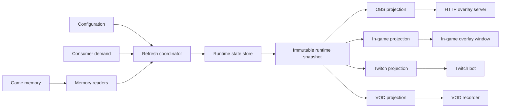

# Data Flow Refactor Plan

## Purpose

This is the living design and implementation plan for refactoring the
application data flow. It complements `data_flow_architecture.md`, which
documents the current system. This document defines the target architecture,
the decisions made during design, and the migration order.

## Status

- Branch: `codex/refactor-data-exchange`
- Implementation status: phase 1-3 in progress
- Compatibility rule: keep existing intervals, consumer gating, payloads, and
  VOD format while replacing their internal data boundary incrementally.

## Goals

- Read game memory once per required refresh task, not once per consumer.
- Keep one authoritative runtime state for a current game run.
- Make one feature available to OBS, the in-game overlay, Twitch, and VODs
  without duplicating memory reads or domain logic.
- Support different freshness requirements, such as 500 ms, 1 s, and 10 s.
- Make consumer activation explicit so unnecessary memory reads are skipped.
- Keep HTTP and IRC threads read-only with respect to game runtime state.
- Allow incremental migration without changing existing user-visible behavior.

## Non-Goals

- No external message broker or process-to-process event system.
- No dependency-injection framework.
- No big-bang rewrite of all data flows.
- No requirement that all consumers use the same final presentation format.

## Target Flow



## Architectural Layers

### 1. Memory Readers

Readers know how to access game memory and return normalized raw results.
They do not import UI, OBS, Twitch, VOD, or presentation code.

Examples:

- `PlayerSnapshotReader`: player stats, inventory, weapons, tomes, banishes.
- `CombatMetricsReader`: run timer and mob kills.
- `ChestReader`: counters, keys, and expected chest inputs.
- `PowerupReader`: powerup tracking state and map context.

### 2. Refresh Coordinator

The coordinator owns scheduling and activation decisions. It:

- registers refresh tasks;
- determines whether each task is required by active consumers;
- executes tasks only when due;
- coalesces shared prerequisite reads;
- applies successful and failed read results to runtime state;
- exposes diagnostics such as last run, next due time, and last error.

The initial implementation should use one in-process scheduler tick. The tick
checks which tasks are due; it does not imply a memory read on every tick.

### 3. Runtime State Store

`LiveRunTracker` is the transitional implementation of the runtime state
store. It remains the single source of truth for data shared by consumers, but
its internals must be organized into feature groups rather than a flat set of
unrelated fields and methods.

Recommended groups:

- `RunState`: run identity, lifecycle, current stage, reset detection.
- `PlayerState`: player stats, level, inventory, weapons, tomes, banishes.
- `CombatState`: run timer, kills, KPS history and derived KPS values.
- `ProgressionState`: chests, keys, Chaos Tome, stage progression.
- `WorldState`: map seed, map context, map activity totals.
- `PowerupState`: powerup tracking data.
- `TrackedItemState`: tracked item rules, counts, and events.
- `AvailabilityState`: freshness and read status for each feature group.

### 4. Immutable Runtime Snapshot

Consumers receive a coherent read-only snapshot assembled from the runtime
state store. They must not call memory readers or mutate tracker state.

Each feature group exposes both its value and its `FeatureStatus`. The status
distinguishes:

- never loaded;
- currently available and fresh;
- temporarily unavailable after a read error;
- stale but still usable as the last known value;
- unavailable because the game is not running.

### 5. Consumer Projections

Each consumer gets its own projection. A projection formats domain data for a
specific interface and contains no game-memory access or shared domain rules.

- OBS projection produces the overlay JSON payload.
- In-game projection produces values or HTML suitable for desktop widgets.
- Twitch projection produces compact command responses and announcements.
- VOD projection produces a stable persisted recording schema.

## Agreed Rules

1. A shared feature is read and interpreted once, then exposed through the
   runtime state store to all consumers.
2. Consumers do not read game memory directly.
3. Consumers do not own independent copies of shared domain state.
4. The same feature may have different final formats for OBS, in-game overlay,
   Twitch, and VOD.
5. Domain calculations belong to feature state, not to projections.
6. Presentation formatting belongs to projections, not to the runtime state
   store.
7. A feature may use multiple refresh tasks when individual fields have
   different freshness requirements.
8. Migration must preserve existing refresh intervals and gating before any
   behavior changes are intentionally made.

## Confirmed Design Decisions

- The runtime is lazy by default. A feature is read only while at least one
  active consumer requires it. An enabled but inactive widget, command, or
  integration must not create memory-read load.
- OBS demand is active when the local overlay server is running and the
  specific widget is enabled. It is not inferred from individual HTTP requests.
- In-game demand is active when its runtime is running and the specific widget
  is enabled, even if the game window temporarily hides the overlay.
- Twitch demand is active when the bot is connected and its corresponding
  command is enabled. The data is kept fresh before a chat command arrives.
- Actual chest counters (`bought` and `purchased`) remain a 10-second task.
  They are not a real-time requirement.
- Scheduler intervals are internal implementation defaults. VOD snapshot
  cadence is the only user-facing data-flow interval.
- Stage transitions are a shared domain lifecycle change. They keep Live Stats
  and VOD stage summaries correct and also support Twitch stage announcements.
  The current 10-second cadence remains the initial behavior. The new task
  architecture must allow it to be changed later without consumer rewrites.
  Other feature changes remain snapshot-driven unless a concrete event consumer
  is added later.
- Migration is incremental. The first migration preserves behavior; intentional
  corrections, such as stricter VOD completeness rules, are separate changes.
- VOD records are not dropped solely because a non-critical read fails. A
  projection uses the last still-acceptable value when available; otherwise it
  writes `null` for that field. The exact freshness limits and critical fields
  remain open design decisions.
- `null` is an internal and persisted-data representation of a missing value.
  Visual projections render it as `--`; Twitch projections use a meaningful
  human-readable response. Display placeholders must not be stored in runtime
  state or VOD JSON.
- On a partial read failure, the runtime state retains the last successful
  value for that feature group until its freshness limit expires. After expiry,
  visual projections render `--` and the VOD projection writes `null`.
- The first migration records per-feature freshness without changing current
  consumer behavior. New stale-expiry behavior is introduced only as an
  intentional follow-up after compatibility is verified.
- The VOD snapshot interval UI remains unchanged for now, including its current
  effective 10-second minimum capture cadence. Improving that UX is deferred.
- A confirmed game end does not erase the last completed run. The application
  retains a frozen last-run snapshot for local post-run inspection; it stops
  treating retained memory values as live data. A confirmed new run clears the
  active per-run state and begins a new run snapshot while session-level
  tracking remains separate.
- The retained completed run survives the following main-menu transition or
  game-process closure until a new run starts or the application exits.
- `RuntimeGameMode.GAME_OVER` maps to the user-facing completed-run lifecycle
  state. The game currently exposes game-over, not a separate player-death
  memory flag, so the architecture must not claim a more specific cause.
- Live Stats presents a completed run for local review. External consumer
  behavior for retained data is unchanged during the first migration; a new run
  replaces the retained state through its normal refresh path. Any distinct
  completed-run presentation for OBS, in-game overlay, or Twitch is deferred
  until it has a concrete user need.

## Refresh Model

Refresh scheduling is task-based rather than UI-timer-based.

```python
RefreshTask(
    id="combat_metrics",
    interval_ms=500,
    reads=("run_timer", "mob_kills"),
    required_by=("live_stats.kps", "obs.kps", "in_game.kps", "twitch.kps"),
)
```

Each task has:

- a stable identifier;
- a default interval;
- its required memory readers or prerequisites;
- a demand predicate or consumer requirements;
- an apply function that updates one or more feature states;
- an error policy;
- diagnostics metadata.

The coordinator should support arbitrary intervals. The currently known
requirements are:

| Task group | Current intended interval | Notes |
|---|---:|---|
| Combat metrics: timer and kills sampling | 500 ms | Only while a consumer needs live KPS. The displayed instant KPS uses approximately one-second game-time windows. |
| Powerups and expected chest inputs | 500 ms | Driven by relevant widgets or commands. |
| In-game event timer | 500 ms | Current fast stage-timer read is driven by the 500 ms fast loop. |
| Full player snapshot | 10 s | Heavy reads: stats, items, weapons, tomes, banishes. |
| VOD capture | Typically 30 s | Persists the latest compatible VOD projection; does not itself require a new memory read. |

### Current Interval Audit

This is the actual current behavior to preserve during the first migration.

| Data group or operation | Current cadence | Current gating / notes |
|---|---:|---|
| Slow player refresh scheduler | 10 s | Runs when Live Stats, recording, armed auto-recording, OBS, a relevant in-game widget, or Twitch is active. |
| Player stats, passive items, level, map seed, stage pointer | 10 s | Read by the slow player refresh. |
| Stage transition and stage summary | 10 s | `current_stage_index` advances only when a full player snapshot is applied. Fast stage-timer reads do not change stage summary state. |
| Weapons, tomes, banishes, disabled items, damage sources | 10 s | Read only when recording, Live Stats, OBS, or Twitch is active. Disabled items are cached once per run and retried until available. |
| Map activity totals and full chest state | 10 s | Read by the slow player refresh. |
| Actual chest counters: bought and purchased | 10 s | Read after the full player snapshot. |
| Fast refresh scheduler | 500 ms by default | Configurable internally through `FAST_TRACKER_INTERVAL_MS`; current lower bound is 100 ms. |
| Owner stats resolution and Chaos Tome state | 500 ms | Runs whenever the fast scheduler itself is active. |
| Powerup tracking | 500 ms | Only when Live Stats, relevant in-game widget, or enabled Twitch powerup command requires it. |
| Expected chest inputs | 500 ms | Currently runs whenever the fast scheduler is active, even when no chest-specific consumer is active. This becomes a task-level lazy-gating migration target. |
| Run timer for KPS | 500 ms | Only when a KPS consumer is active. |
| Mob kills for KPS | Up to 500 ms | Read only when the game timer changed since the preceding fast tick. |
| Instant KPS display | About 1 s | Derived from fast samples only when their game-time delta is 0.9 to 1.2 seconds. |
| Fast stage timer | 500 ms | Only while the in-game event-timer widget is enabled. |
| In-game overlay rendering | 500 ms and 10 s | Rendering timers; they normally consume cached runtime state rather than trigger memory reads. |
| OBS browser polling | 500 ms default | Configurable from 250 to 5000 ms; polling cached HTTP state does not trigger a memory read. |
| VOD capture check | On each 10 s slow refresh | The configured VOD interval only controls eligibility for capture. It does not change slow memory-read cadence. |

### VOD Snapshot Interval Behavior

`PLAYER_STATS_RECORD_INTERVAL_SECONDS` is exposed in the UI and defaults to
30 seconds. It is passed to `VodRecorder.should_capture()`, but that method is
called only after a successful 10-second slow refresh. Therefore a configured
interval below 10 seconds does not make Live Stats read more often and cannot
produce records more frequently than the slow refresh cadence. A configured
5-second interval currently yields capture on the next eligible 10-second
tick, not every 5 seconds.

### Data Classification Clarification

`map_seed`, `stage_ptr`, raw `stage_index`, and run timer are lifecycle fields.
They are updated by the 10-second slow player snapshot and must not be treated
as static metadata: seed and stage pointer can change during normal stage
transitions. Static-per-run data instead means values such as disabled-item
pool data and stable map context (for example map type and activity maxima).

### Chest Feature Breakdown

Chests are one domain feature with multiple tasks, not one fixed interval:

- expected key-proc inputs: 500 ms when a live consumer needs them;
- actual bought/purchased counters: 10 s; not a real-time requirement;
- map chest totals: 10 s unless a consumer demonstrates a real-time need;
- VOD capture: writes the latest recorded chest state at VOD cadence.

## Demand and Gating

Consumers declare requirements by feature, not by direct calls into readers.
Examples:

- Live Stats visible: player snapshot, combat metrics, and enabled panels.
- OBS KPS widget enabled while the local server runs: combat metrics.
- OBS stats widget enabled while the local server runs: player snapshot.
- In-game event timer enabled while its runtime runs: stage timer.
- Twitch `!kps` enabled and bot connected: combat metrics, kept fresh before a
  command arrives.
- VOD recording: fields required by the VOD projection.

The coordinator aggregates demand. If several consumers require the same
feature, the task still runs once at the strictest required freshness.

## Threading Model

- Game-memory reads, refresh coordination, and runtime-state mutation remain
  on one owner thread during the first migration.
- `OverlayStateStore` and HTTP request threads only read already-built data.
- `TwitchBotWorker` only reads immutable snapshots and sends IRC messages.
- A later move of memory reads to a worker thread is a separate decision and
  must preserve single-writer runtime-state ownership.

## VOD Model

VOD storage consumes a dedicated VOD projection rather than UI or OBS data.
The VOD projection is responsible for a stable persisted schema and can omit
presentation-only fields. VOD capture should use the latest coherent runtime
snapshot; it must not duplicate memory reads solely to write a recording.

## Resolved Implementation Decisions

- `FeatureStatus` stores availability, last success, last error, and failure
  count. A successful value becomes `stale` in snapshots after the existing
  tracker stale timeout; rendering behavior remains unchanged in this release.
- `RuntimeStateSnapshot` is the public read-only consumer boundary. It includes
  run lifecycle, latest player snapshot, KPS, chest state, summaries, tracked
  items, and per-feature statuses.
- Demand is evaluated by task predicates on each coordinator tick. Existing
  UI predicates remain the compatibility source while feature-specific demand
  is migrated incrementally.
- `RefreshCoordinator` owns due-time, failure, and diagnostics bookkeeping.
  Existing readers retain the single fast refresh path, which already shares
  `owner_stats`; splitting it into independently demand-gated reader tasks is
  the next migration step.
- Stage transitions remain snapshot-driven at 10 seconds and are observed by
  Twitch through runtime snapshots. No general event bus is introduced.
- Actual chest counters remain a 10-second full-snapshot operation.
- Intervals remain internal defaults. The VOD UI setting retains its current
  effective 10-second minimum capture cadence.

## Migration Plan

### Phase 0: Design and Safety Net

- Resolve open decisions and record them in this document.
- Add characterization tests around current KPS, chest, VOD, OBS, in-game,
  and Twitch behavior.
- Correct `data_flow_architecture.md` where it no longer describes the code.

### Phase 1: Snapshot Contract

- Introduce immutable runtime snapshot and feature-status types.
- Build snapshots from the existing `LiveRunTracker` without changing readers
  or timers.
- Move OBS, in-game overlay, and Twitch reads toward projections over that
  snapshot.

### Phase 2: Projections

- Extract OBS projection from `overlay_state.py`.
- Extract in-game overlay projection from GUI rendering code.
- Extract Twitch command projection from `twitch_bot.py`.
- Add a VOD projection while preserving the current on-disk format.

### Phase 3: Refresh Tasks and Coordinator

- Register existing 500 ms, 1 s, and 10 s behavior as explicit tasks.
- Replace direct UI-owned timer logic with the coordinator incrementally.
- Preserve existing consumer gating during the migration.

### Phase 4: Feature-State Organization

- Split tracker internals into grouped feature states without changing its
  external behavior.
- Migrate one vertical feature group at a time, beginning with combat metrics
  and chests.

### Phase 5: Cleanup and Improvements

- Remove legacy direct consumer access paths.
- Add diagnostics UI or structured logs if useful.
- Revisit read cadences using measured cost and correctness requirements.

## Progress Log

### 2026-07-10

- Created this living design document.
- Agreed on a central runtime state store, immutable snapshots, task-based
  refresh scheduling, and per-consumer projections.
- Next discussion topic: freshness, availability, and transient-read error
  semantics.

### 2026-07-10 Implementation

- Added `FeatureStatus`, `RunLifecycle`, and `RuntimeStateSnapshot` to the
  tracker boundary.
- Added a Qt-independent task coordinator with demand, due-time, and failure
  diagnostics; the existing 500 ms and 10 s UI timers now tick it.
- Added OBS and VOD snapshot projections; Twitch stage announcements and
  in-game KPS use the snapshot boundary when available.

### 2026-07-10 Fast Task Migration

- Replaced the shared fast refresh callback with independent 500 ms tasks for
  combat metrics, powerups, expected chest inputs, event timer, and Chaos Tome.
- Added a per-tick lazy context that resolves shared `owner_stats` once for all
  due owner-dependent tasks.
- Made OBS KPS demand require both a running local server and an enabled KPS
  widget; unrelated fast tasks no longer run solely because OBS is configured.
- Isolated task failures through per-feature status updates while retaining the
  last successful runtime value.
