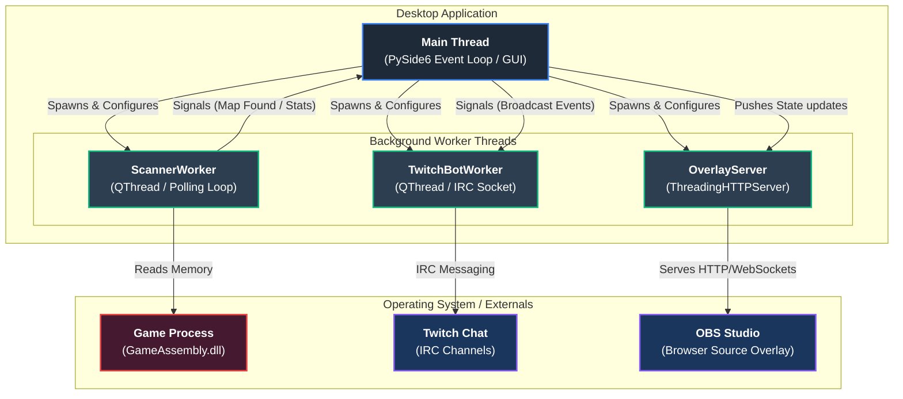

# BonkScanner Developer Wiki - Home

Welcome to the **BonkScanner Developer Wiki**. This documentation is designed to help developers, contributors, and reverse-engineers understand the architecture, internal algorithms, and memory-reading logic of BonkScanner.

---

## Mental Model

BonkScanner has three major responsibilities:
1. **Automated Rerolling**: Automating map selection and game restarts until a target map (defined by template rules or threshold scores) is successfully generated.
2. **Live Run Inspection**: Reading the game process memory in real-time to track stats, weapons, inventory items, and boss curses without relying on OCR or screen scraping.
3. **Run Recording & Replay**: Logging snapshot data to local files (`.jsonl`) for replay visualization, analytics, and sharing.

---

## System Architecture & Concurrency Model

To prevent the User Interface (UI) from freezing during active scanning, memory polling, and network communication, BonkScanner utilizes a strict multithreaded architecture.

### Threading Rules & State Sync
- **Main Thread (GUI):** Renders all elements (run control, templates, session logs, live stat panels). It receives all updates from background threads via **PySide6 Signals and Slots** to guarantee thread safety.
- **ScannerWorker Thread (`QThread`):** Polling thread that executes the scan loop. It checks map stability, reads map values, checks evaluation conditions, and controls restarts.
- **TwitchBotWorker Thread (`QThread`):** Runs an IRC connection loop. It listens for commands and broadcasts messages without blocking the GUI.
- **ThreadingHTTPServer Thread:** Runs a lightweight web and WebSocket server to feed overlay widgets.

---

## Code Map & Component Responsibilities

Here is how the responsibilities are distributed across the project's codebase:

| Component / Filename | Responsibility |
| :--- | :--- |
| **Startup & Application Control** | |
| [src/main.py](../../src/main.py) | Entry point of the desktop application. Instantiates `QApplication` and displays the GUI. |
| [src/config.py](../../src/config.py) | Loads, validates, and saves configuration settings, profile templates, scoring configurations, custom hotkeys, and version histories in `config.json`. |
| [src/updater.py](../../src/updater.py) | Checks for updates from releases and handles self-updates for packaged applications. |
| **User Interface (PySide6)** | |
| [src/gui.py](../../src/gui.py) | Backward compatibility facade containing core interfaces for tests and imports. |
| [src/gui_app.py](../../src/gui_app.py) | Definitive application container class (`MegabonkApp`) linking core business logic to UI events. |
| [src/gui_layout.py](../../src/gui_layout.py) | Defines the main desktop application layout, split views, and primary window panels. |
| [src/gui_scanner.py](../../src/gui_scanner.py) | Manages scanner settings UI, scan state machines, and active session control buttons. |
| [src/gui_run_control.py](../../src/gui_run_control.py) | Layout and button event mappings for resetting runs and configuring game restart options. |
| [src/gui_player_stats.py](../../src/gui_player_stats.py) | Controls the live statistics panels, item inventory styling, weapon upgrade tabs, and item sorting. |
| [src/gui_templates.py](../../src/gui_templates.py) | Dialogs and controls for creating, deleting, and tweaking template profiles. |
| [src/gui_dialogs.py](../../src/gui_dialogs.py) | Custom prompt dialogs, scoring rules adjustments, and details widgets. |
| [src/gui_shared.py](../../src/gui_shared.py) | Base classes, utility widgets, and common state-sharing interfaces for the GUI components. |
| [src/gui_styles.py](../../src/gui_styles.py) | Central styling stylesheets, color constants, tier badges, and theme parameters. |
| **Logic & Evaluators** | |
| [src/logic.py](../../src/logic.py) | Functional core that evaluates map stats against rules (Templates) and computes map scores (Scores). |
| [src/runtime_stats.py](../../src/runtime_stats.py) | Standardizes raw map details into structures suitable for matching logic. |
| [src/live_run_tracker.py](../../src/live_run_tracker.py) | Tracks live stage transitions, item acquisition differentials, and chaos stats during runs. |
| **Memory Readers & Low-level** | |
| [src/memory.py](../../src/memory.py) | Core memory access module wrapping Windows APIs (OpenProcess, ReadProcessMemory) to read raw bytes. |
| [src/game_data.py](../../src/game_data.py) | Uses pointers to read current map properties, seed, status indicators, and generation cycles. |
| [src/player_stats.py](../../src/player_stats.py) | Decodes complex player statistics, inventory dictionaries, tome modifications, and passive item arrays. |
| [src/item_metadata.py](../../src/item_metadata.py) | Normalization tables mapping raw item hashes or names to readable titles and rarity. |
| [src/run_control.py](../../src/run_control.py) | Keyboard automation engine for issuing restart macro keystrokes to the game process. |
| **Integrations & Recording** | |
| [src/vod_storage.py](../../src/vod_storage.py) | Serializes and deserializes snapshot data to `.jsonl` run records. |
| [src/twitch_bot.py](../../src/twitch_bot.py) | Handles Twitch channel connection, IRC message handling, and command processing. |
| [src/overlay_server.py](../../src/overlay_server.py) | Lightweight server hosting CSS/JS web widgets for OBS Studio overlays. |

---

## Navigation

- Learn about scanning and evaluations: [Scanner & Evaluation Wiki](./Scanner_and_Evaluation.md)
- Learn about memory architectures: [Memory & Live Stats Wiki](./Memory_and_Live_Stats.md)
- Learn about stage transitions: [Stage Summary Transitions Wiki](./Stage_Summary_Transitions.md)
- Learn about VODs and recording formats: [Recordings & VODs Wiki](./Recordings_and_VODs.md)
- Learn about integrations and overlays: [Integrations & Overlays Wiki](./Integrations_and_Overlay.md)
- Learn about troubleshooting and debugging: [Troubleshooting & Diagnostics Wiki](./Troubleshooting_and_Diagnostics.md)