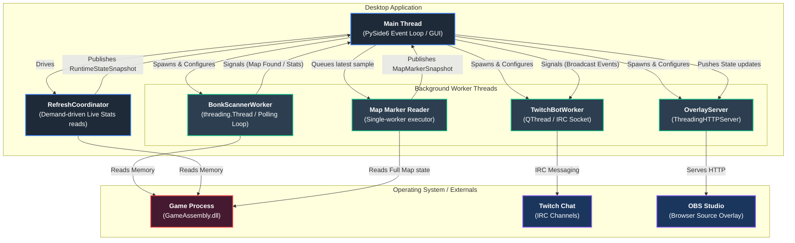

# BonkScanner Developer Wiki - Home

Welcome to the **BonkScanner Developer Wiki**. This documentation is designed to help developers, contributors, and reverse-engineers understand the architecture, internal algorithms, and memory-reading logic of BonkScanner.

---

## Mental Model

BonkScanner has three major responsibilities:
1. **Automated Rerolling**: Automating map selection and game restarts until a target map (defined by template rules or threshold scores) is successfully generated.
2. **Live Run Inspection**: Reading the game process memory in real-time to track stats, weapons, inventory items, and boss curses without relying on OCR or screen scraping.
3. **Run Recording & Replay**: Logging snapshot data to local files (`.jsonl`) for replay visualization, analytics, and sharing.

---

## System Architecture & Concurrency Model

BonkScanner separates long-running scanner, map-marker, network and HTTP work
from the UI. Demand-driven Live Stats refresh tasks remain on the application
owner thread, but they have explicit cadences and share physical reads within a
refresh pass.

```mermaid
graph TD
    %% Styling
    classDef mainThread fill:#1E2A38,stroke:#3B82F6,stroke-width:2px,color:#fff;
    classDef workerThread fill:#2C3E50,stroke:#10B981,stroke-width:2px,color:#fff;
    classDef gameProcess fill:#451A30,stroke:#EF4444,stroke-width:2px,color:#fff;
    classDef external fill:#1A365D,stroke:#8B5CF6,stroke-width:2px,color:#fff;

    subgraph Desktop Application
        MainUI["<b>Main Thread</b><br>(PySide6 Event Loop / GUI)"]:::mainThread
        RefreshTasks["<b>RefreshCoordinator</b><br>(Demand-driven Live Stats reads)"]:::mainThread

        subgraph Workers [Background Worker Threads]
            ScannerWorker["<b>BonkScannerWorker</b><br>(threading.Thread / Polling Loop)"]:::workerThread
            MapMarkerWorker["<b>Map Marker Reader</b><br>(Single-worker executor)"]:::workerThread
            TwitchBot["<b>TwitchBotWorker</b><br>(QThread / IRC Socket)"]:::workerThread
            OverlayServer["<b>OverlayServer</b><br>(ThreadingHTTPServer)"]:::workerThread
        end
    end

    subgraph Operating System / Externals
        GameInstance["<b>Game Process</b><br>(GameAssembly.dll)"]:::gameProcess
        TwitchChat["<b>Twitch Chat</b><br>(IRC Channels)"]:::external
        OBS["<b>OBS Studio</b><br>(Browser Source Overlay)"]:::external
    end

    %% Interactions
    MainUI -- Spawns & Configures --> ScannerWorker
    MainUI -- Drives --> RefreshTasks
    MainUI -- Queues latest sample --> MapMarkerWorker
    MainUI -- Spawns & Configures --> TwitchBot
    MainUI -- Spawns & Configures --> OverlayServer

    ScannerWorker -- Reads Memory --> GameInstance
    RefreshTasks -- Reads Memory --> GameInstance
    MapMarkerWorker -- Reads Full Map state --> GameInstance
    ScannerWorker -- "Signals (Map Found / Stats)" --> MainUI
    RefreshTasks -- "Publishes RuntimeStateSnapshot" --> MainUI
    MapMarkerWorker -- "Publishes MapMarkerSnapshot" --> MainUI
    MainUI -- "Signals (Broadcast Events)" --> TwitchBot
    MainUI -- "Pushes State updates" --> OverlayServer

    TwitchBot -- IRC Messaging --> TwitchChat
    OverlayServer -- Serves HTTP --> OBS
```

### Threading Rules & State Sync
- **Main Thread (GUI):** Owns UI widgets and the demand-driven Live Stats
  `RefreshCoordinator`. One per-pass `RefreshTickContext` shares logical memory
  sources between due tasks. Read-only runtime snapshots and
  `OverlayStateStore` are the state boundaries used by other consumers.
- **BonkScannerWorker (`threading.Thread`):** Daemon polling thread owned by the
  `Scanner` component. It checks map stability, reads map values, evaluates
  conditions, and controls restarts while UI work is marshalled back to Qt.
- **Map Marker Worker:** A single-worker executor serializes Full Map memory
  polling, manual placement and client close. The 25 ms UI timer queues
  latest-wins work and never waits for it.
- **TwitchBotWorker Thread (`QThread`):** Runs an IRC connection loop. It listens for commands and broadcasts messages without blocking the GUI.
- **ThreadingHTTPServer Thread:** Runs a lightweight local HTTP server to feed
  overlay widgets, which poll the state endpoint.

---

## Code Map & Component Responsibilities

Here is how the responsibilities are distributed across the project's codebase:

| Component / Filename | Responsibility |
| :--- | :--- |
| **Startup & Application Control** | |
| [src/main.py](../../src/main.py) | Entry point of the desktop application. Instantiates `QApplication` and displays the GUI. |
| [src/app/coordinator.py](../../src/app/coordinator.py) | Owns the runtime instances (live run tracker, overlay server and state store, snapshot store, VOD recorder). Qt-free. |
| [src/app/refresh_coordinator.py](../../src/app/refresh_coordinator.py) | Schedules demanded refresh tasks and provides the per-pass source cache/metadata boundary. |
| [src/app/read_sources.py](../../src/app/read_sources.py) | Canonical names and helpers for shared logical memory sources. |
| [src/app/refresh_tasks.py](../../src/app/refresh_tasks.py) | Registers Live Stats cadences and publishes fast memory readings to the tracker/UI projections. |
| [src/app/player_stats_memory.py](../../src/app/player_stats_memory.py) | Acquires Live Stats data, owns reconnect streaks and lazily manages the two coordinator-owned memory clients. |
| [src/app/config.py](../../src/app/config.py) | Loads, validates, and saves configuration settings, profile templates, scoring configurations, custom hotkeys, and version histories in `config.json`. |
| [src/app/version.py](../../src/app/version.py) | Holds `CURRENT_VERSION` and version-string comparison. |
| [src/app/update_flow.py](../../src/app/update_flow.py) | Decides whether a packaged build should update, asking through a caller-supplied confirm callback. |
| [src/infra/updater.py](../../src/infra/updater.py) | Fetches the latest GitHub release and downloads/applies the new `.exe`. |
| [src/ui/dialogs/update_dialog.py](../../src/ui/dialogs/update_dialog.py) | The "Update Available" dialog. |
| [src/ui/dialogs/update_prompt.py](../../src/ui/dialogs/update_prompt.py) | Adapter wiring the update flow to the GUI thread and the dialog. |
| **User Interface (PySide6)** | |
| [src/gui_app.py](../../src/gui_app.py) | Definitive application container class (`MegabonkApp`) linking core business logic to UI events. |
| [src/ui/layout.py](../../src/ui/layout.py) | Defines the main desktop application layout, split views, and primary window panels. |
| [src/gui_scanner.py](../../src/gui_scanner.py) | Manages scanner settings UI, scan state machines, and active session control buttons. |
| [src/gui_run_control.py](../../src/gui_run_control.py) | Layout and button event mappings for resetting runs and configuring game restart options. |
| [src/ui/tabs/player_stats/](../../src/ui/tabs/player_stats/) | Controls the live statistics panels, item inventory styling, weapon upgrade tabs, and item sorting. |
| [src/ui/tabs/templates/](../../src/ui/tabs/templates/) | Dialogs and controls for creating, deleting, and tweaking template profiles. |
| [src/ui/dialogs/](../../src/ui/dialogs/) | Custom prompt dialogs, scoring rules adjustments, and details widgets. |
| [src/ui/shared.py](../../src/ui/shared.py) | Base classes, utility widgets, and common state-sharing interfaces for the GUI components. |
| [src/ui/styles.py](../../src/ui/styles.py) | Qt stylesheets, tier badges, and theme parameters. Colour constants moved to [src/core/item_metadata.py](../../src/core/item_metadata.py). |
| [src/gui_overlay.py](../../src/gui_overlay.py) | Settings panel layout and button callbacks for the OBS HTTP server overlay. |
| [src/gui_in_game_overlay.py](../../src/gui_in_game_overlay.py) | Controls the QTimer ticks and lifecycle management of the inside-game overlay. |
| [src/gui_in_game_overlay_window.py](../../src/gui_in_game_overlay_window.py) | Translucent, click-through widget canvas for desktop overlay drawing. |
| [src/projections/in_game_html.py](../../src/projections/in_game_html.py) | Rich HTML layouts generator for in-game KPS, powerups, stats, event timer, Luck and timed-item widgets. |
| [src/gui_in_game_overlay_settings.py](../../src/gui_in_game_overlay_settings.py) | Settings tab layout and scaling configuration dialogs for inside-game widgets. |
| [src/gui_twitch.py](../../src/gui_twitch.py) | Chatbot activation, channel configuration, and console messaging GUI widgets. |
| **Logic & Evaluators** | |
| [src/core/logic.py](../../src/core/logic.py) | Functional core that evaluates map stats against rules (Templates) and computes map scores (Scores). |
| [src/core/runtime_stats.py](../../src/core/runtime_stats.py) | Standardizes raw map details into structures suitable for matching logic. |
| [src/core/tracker/live_run.py](../../src/core/tracker/live_run.py) | Tracks live stage transitions, item acquisition differentials, and chaos stats during runs. |
| **Memory Readers & Low-level** | |
| [src/infra/memory/reader.py](../../src/infra/memory/reader.py) | Read-only `pymem` backend, typed reads, module-base caching and normalized memory exceptions. |
| [src/infra/memory/game_data_client.py](../../src/infra/memory/game_data_client.py) | Uses pointers to read current map properties, seed, status indicators, and generation cycles. |
| [src/infra/memory/player_stats_client.py](../../src/infra/memory/player_stats_client.py) | Decodes stats, inventories, weapons/tomes, timers, run counters, powerups, permanent modifiers and shrine state. |
| [src/infra/memory/map_marker_client.py](../../src/infra/memory/map_marker_client.py) | Read-only Full Map viewport/current-interactable adapter with bounded traversal and fail-closed validation. |
| [src/app/map_marker_tracker.py](../../src/app/map_marker_tracker.py) | Owns marker connection/retry state and publishes immutable map-marker snapshots. |
| [src/core/item_metadata.py](../../src/core/item_metadata.py) | Normalization tables mapping raw item hashes or names to readable titles and rarity. |
| [src/core/run_control.py](../../src/core/run_control.py) | The run-control port: provider protocol, errors, and type aliases. |
| [src/infra/keyboard_run_control.py](../../src/infra/keyboard_run_control.py) | Keyboard automation engine for issuing restart macro keystrokes to the game process. |
| [src/infra/process.py](../../src/infra/process.py) | Pure win32 window/process helpers used to find and score the game window. |
| [src/infra/hotkeys.py](../../src/infra/hotkeys.py) | Low-level system keyboard hook manager mapping global keystrokes to restart commands. |
| [src/infra/crash_journal.py](../../src/infra/crash_journal.py) | Structured crash and exception journal writer for diagnostics and troubleshooting. |
| **Integrations, Projections & Recording** | |
| [src/core/build_progression.py](../../src/core/build_progression.py) | Pure domain model and evaluation rules for build requirements, copy counts, and deadlines. |
| [src/app/build_progression.py](../../src/app/build_progression.py) | Coordinator-owned service tracking runtime requirement transitions and build state. |
| [src/ui/dialogs/build_progression.py](../../src/ui/dialogs/build_progression.py) | Build manager dialog for creating, editing, and managing build progression checklists. |
| [src/projections/build_progression.py](../../src/projections/build_progression.py) | Formats build progression state for overlays and Twitch bot output. |
| [src/infra/vod_storage.py](../../src/infra/vod_storage.py) | Serializes and deserializes snapshot data to `.jsonl` run records. |
| [src/twitch_bot.py](../../src/twitch_bot.py) | Handles Twitch channel connection, IRC message handling, and command processing. |
| [src/twitch_auth.py](../../src/twitch_auth.py) | Client library for Twitch OAuth token generation and authorization scopes. |
| [src/infra/twitch_credentials.py](../../src/infra/twitch_credentials.py) | Encrypted storage, file paths, and local settings manager for Twitch credentials. |
| [src/infra/overlay_server.py](../../src/infra/overlay_server.py) | Lightweight server hosting CSS/JS web widgets for OBS Studio overlays. |
| [src/projections/obs.py](../../src/projections/obs.py) | Builds the OBS overlay payload from a tracker snapshot. The thread-safe `OverlayStateStore` that holds it lives in `overlay_server.py`. |

---

## Navigation

- Learn about scanning and evaluations: [Scanner & Evaluation Wiki](./Scanner_and_Evaluation.md)
- Learn about memory architectures: [Memory & Live Stats Wiki](./Memory_and_Live_Stats.md)
- Learn about stage transitions: [Stage Summary Transitions Wiki](./Stage_Summary_Transitions.md)
- Learn about VODs and recording formats: [Recordings & VODs Wiki](./Recordings_and_VODs.md)
- Learn about integrations and overlays: [Integrations & Overlays Wiki](./Integrations_and_Overlay.md)
- Learn about in-game desktop overlays: [In-Game Overlay Wiki](./In_Game_Overlay.md)
- Learn about troubleshooting and debugging: [Troubleshooting & Diagnostics Wiki](./Troubleshooting_and_Diagnostics.md)
