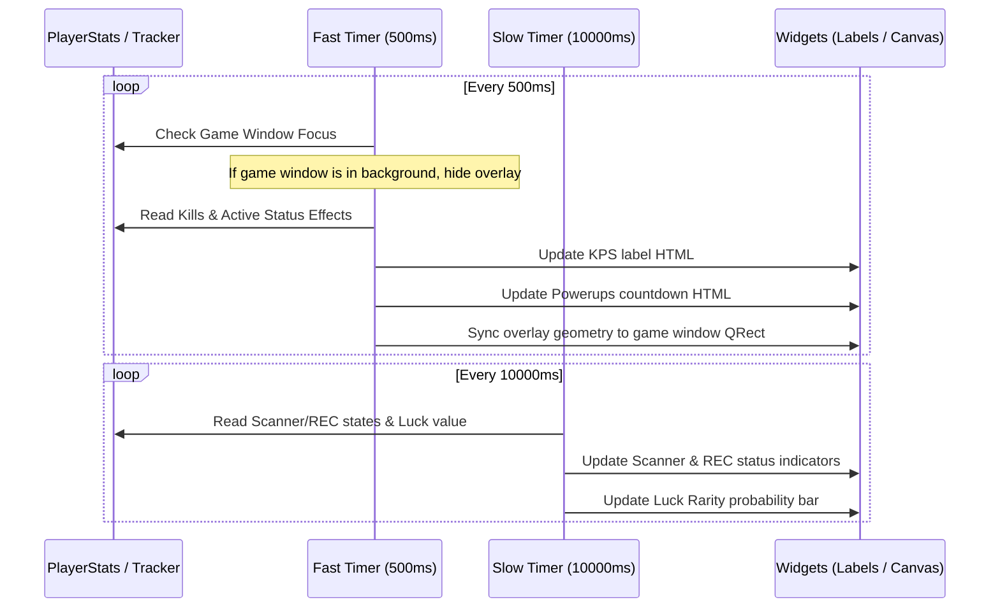

# BonkScanner Developer Wiki - In-Game Desktop Overlay

This page documents the desktop-level transparent **In-Game Overlay** of BonkScanner. Unlike the OBS stream overlay (which runs a local HTTP server for streaming platforms), the In-Game Overlay renders directly on the player's desktop as a click-through, frameless PySide6 overlay window aligned on top of the game screen.

---

## 1. Architecture & Core Components

The overlay is implemented across four files:
- **[gui_in_game_overlay.py](../../src/gui_in_game_overlay.py)**: Defines `InGameOverlayMixin`, which implements state machines, timer loops, game window alignment, and setting callbacks.
- **[gui_in_game_overlay_window.py](../../src/gui_in_game_overlay_window.py)**: Implements the translucency canvas window, mouse click-through behavior, custom segment drawing, and widget drag-and-drop mechanics.
- **[gui_in_game_overlay_render.py](../../src/gui_in_game_overlay_render.py)**: Renders HTML strings (rich text) for indicators, KPS metrics, powerup countdowns, and calculates Luck rarity drop probabilities.
- **[gui_in_game_overlay_settings.py](../../src/gui_in_game_overlay_settings.py)**: Builds the GUI settings tab controls and widget scaling double-spinbox dialogs.

---

## 2. Window Custom Flags & Click-Through

To achieve a transparent, non-obtrusive overlay that sits on top of the game without stealing focus or intercepting mouse inputs during active gameplay, `InGameOverlayWindow` is configured with specific Qt window flags:

```python
self.setWindowFlags(
    Qt.FramelessWindowHint
    | Qt.WindowStaysOnTopHint
    | Qt.Tool
    | Qt.WindowTransparentForInput  # Enables mouse click-through
)
self.setAttribute(Qt.WA_TranslucentBackground) # Transparent background canvas
```

### State Switching
- **Standard (Run) Mode:** `Qt.WindowTransparentForInput` is active. All mouse interactions (clicks, drags, scrolls) bypass the overlay and hit the game window directly.
- **Edit Layout Mode:** `Qt.WindowTransparentForInput` is removed. The overlay intercepts clicks, allowing the user to click, drag, and position widgets.

---

## 3. Double Timer Polling Loop

The overlay updates widgets using two separate timer intervals to balance responsive feedback with minimal CPU consumption:



### Fast-Changing Widgets (500ms)
- **KPS (Kills Per Second):** Displays instant KPS, 60s average, 5m average, and run average based on the active run metrics.
- **Active Powerups:** Reads active status effect durations (Haste, Rage, Shield, Stonks, TimeFreeze). Renders counts and automatically hides when no buffs are active.
- **Geometry Sync:** Uses Windows API `win32gui.GetWindowRect` to fetch the game window bounds and moves the overlay to match the game window size and position.

### Slow-Changing Widgets (10000ms)
- **Scanner Status:** Renders a green/red circle showing if the automated scanner is active.
- **Recording (REC) Status:** Shows if a run is currently being logged to a `.jsonl` file.
- **Luck Rarity %:** Reads the player's Luck stat, calculates rarity drop rate percentages, and renders them.

---

## 4. Custom Probability Drawing (`LuckRarityBarWidget`)

The rarity distribution probability is displayed both as text percentages and as a segment bar.
The **`LuckRarityBarWidget`** uses Qt `QPainter` to draw a custom segmented color bar:
- Segments are ordered: Legendary (orange), Rare (purple), Uncommon (blue), Common (gray).
- The width of each segment is proportional to its drop rate percentage.
- The bar uses a log-adjusted model of the player's Luck stat to calculate weights:
  $$\text{Strength} = \ln(\text{Luck} + 1.0) \times 1.5$$
  $$\text{Weight}_{\text{rarity}} = \text{BaseWeight}_{\text{rarity}} \times 1.5^{-\text{exponent} \times \text{Strength}}$$
- Rounded clip paths and a semi-transparent slate border are drawn on top to ensure a premium visual appearance.

---

## 5. Drag-and-Drop Layout Configuration

By clicking **Edit Layout** or pressing **F9**, players enter Layout Mode:
1. `InGameOverlayWindow` draws a dark overlay backdrop (`rgba(0, 0, 0, 50)`) and shows a green "Save Layout & Exit" button.
2. Individual widgets (`DraggableOverlayWidget`) apply a dashed white border and a semi-transparent black background.
3. Left-clicking and moving the mouse inside a widget triggers drag-and-drop:
   - Pressed event sets `self._dragging = True` and stores `event.pos()`.
   - Move event moves the widget inside the overlay canvas.
   - Release event sets `self._dragging = False` and triggers the `moved` signal, which updates coordinates in the configuration:
     `config.IN_GAME_OVERLAY["widgets"][widget_id]["x"] / ["y"] = x / y`
4. Exiting layout mode saves the coordinates persistently to `config.json`.
