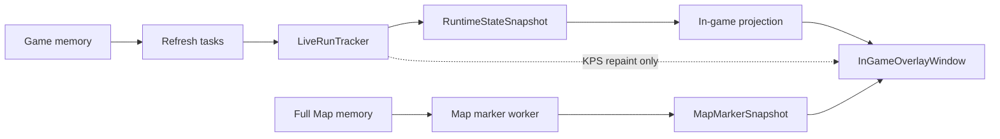

# BonkScanner Developer Wiki — In-Game Overlay

The **In-Game Overlay** is a transparent, click-through PySide6 window aligned
to the Megabonk client area. It is distinct from the OBS browser overlay: it
does not use HTTP, a browser source, or recording files.

## Architecture and data boundary

The implementation is split by responsibility:

- [`src/gui_in_game_overlay.py`](../../src/gui_in_game_overlay.py) owns the
  overlay lifecycle, the 500 ms repaint timer, game-window alignment and UI
  settings callbacks.
- [`src/gui_in_game_overlay_window.py`](../../src/gui_in_game_overlay_window.py)
  owns the translucent click-through canvas, widget placement and edit mode.
- [`src/projections/in_game.py`](../../src/projections/in_game.py) projects a
  `RuntimeStateSnapshot` into the values needed by the overlay.
- [`src/projections/in_game_html.py`](../../src/projections/in_game_html.py)
  formats widget HTML only; it does not read game memory.
- [`src/gui_in_game_overlay_settings.py`](../../src/gui_in_game_overlay_settings.py)
  defines the settings UI and the canonical widget rows.
- [`src/app/map_marker_tracker.py`](../../src/app/map_marker_tracker.py) and
  [`src/infra/memory/map_marker_client.py`](../../src/infra/memory/map_marker_client.py)
  own the separate Full Map marker state and read-only memory adapter.

Ordinary stats/widget data is read on the application owner thread by refresh
tasks. The overlay consumes read-only tracker state and does not construct a
`PlayerStatsClient` or `GameDataClient`. `refresh_kps_widget()` is a deliberate
narrow exception to the usual snapshot boundary: it reads the tracker's four
read-only KPS accessors so a newly published KPS value can be painted
immediately.

Full Map markers are the separate memory path. A 25 ms UI timer submits
latest-wins work to one background executor; `MapMarkerTracker` and its
`MapMarkerMemoryClient` live behind that serialized worker. The GUI only applies
a completed immutable `MapMarkerSnapshot`, and shutdown queues `close()` behind
any in-flight read before disposing the executor.

```mermaid
flowchart LR
    Memory[Game memory] --> Refresh[Refresh tasks]
    Refresh --> Tracker[LiveRunTracker]
    Tracker --> Snapshot[RuntimeStateSnapshot]
    Snapshot --> Projection[In-game projection]
    Projection --> Window[InGameOverlayWindow]
    Tracker -. KPS repaint only .-> Window
    FullMap[Full Map memory] --> MarkerWorker[Map marker worker]
    MarkerWorker --> MarkerSnapshot[MapMarkerSnapshot]
    MarkerSnapshot --> Window
```

## Cadence and freshness

There is **one 500 ms overlay timer** (`overlay_fast_timer`), not separate fast
and slow overlay timers. It handles visibility, geometry, status plaques and
painting. It does not by itself perform memory reads.

The data it paints has different source cadences:

| Data | Source cadence | Notes |
| --- | ---: | --- |
| Scanner and REC status | 500 ms repaint | Application state; no memory read. |
| KPS | Configurable, 500 ms by default | Also repainted directly when combat metrics publish. |
| Powerups and Expected chest inputs | Configurable, 500 ms by default | Read by demanded fast tasks and carried by the tracker. |
| Passive items, Luck, banishes, map context and timed-item cooldowns | 1 s | Shared logical sources in one refresh pass. |
| Event/stage timer, Charge Shrines and Chaos/Dice/passive attribution | 1 s when demanded | Published as read-only tracker state. |
| Full stats, weapons, tomes, damage sources and durable recording payload | 10 s | From the full live snapshot. |
| Full Map projection | 25 ms queue; latest completed sample wins | Dedicated worker; the UI timer never blocks on memory. |
| Automatic marker discovery | 100 ms when enabled | Reads only the game-selected `currentInteractable` and an explicit class allowlist. |

The overlay hides while the game window is inactive and reappears when it is
active. In edit mode it remains visible so the layout can be changed.

## Widgets and Full Map layer

Each ordinary widget has independent enable, position and scale settings:

- **Scanner status** — whether scanning is active.
- **Recording status** — whether player-stat recording is active.
- **KPS** — instant, 60-second, five-minute and run-average metrics.
- **Active powerups** — currently active powerups and their remaining time.
- **Luck rarity %** — rarity chances based on current Luck, optionally with a
  probability bar and expected-count information.
- **Stats** — selected player stats. Fast stage context is used where a stat cap
  depends on the current stage.
- **Event timer** — phase-aware map-event warnings.
- **Item cooldowns** — timed passive-item countdowns. Bob's Light is the first
  supported item; the widget is empty and hidden when no supported timed item is
  held.
- **Build progression** — active build checklist tracking item counts, stat thresholds,
  and progress targets against configurable stage/time deadlines.

Map markers are a separate Full Map layer rather than a normal movable widget.
They support a layer scale, manual markers and optional automatic discovery for
supported interactables. Manual projection remains available when automatic
discovery is disabled.

`item_cooldowns` is intentionally separate from `powerups`: a powerup card
hides when no buff is active, while a timed passive item can remain relevant for
the entire run.

## Timed-item cooldown semantics

Cooldown readings pair each item's absolute next-trigger mark with `MyTime.time`
from the same passive-item pass. The renderer computes and clamps
`next_trigger_time - my_time` at display time.

- A pause freezes the game clock, therefore the displayed countdown freezes too.
- Stage and Graveyard phase transitions do not reset this clock.
- Run lifecycle, not a failed read or a local wall clock, decides when an old
  run's display must be cleared.

For memory-path measurements and validation history, see
[`docs/updates/functional_updates_archive.md`](../updates/functional_updates_archive.md).

## Window behavior and layout editing

The window is frameless, always on top, translucent and click-through during
normal play. Edit mode temporarily enables input so widgets can be dragged and
their positions saved in `config.IN_GAME_OVERLAY["widgets"]`.

Use **Edit Layout** or the configured hotkey (F9 by default) to enter and leave
edit mode. The widget settings table controls visibility and scale; layout mode
controls placement.

## Navigation

- [Architecture](../design/app/data_flow_architecture.md)
- [Integrations and OBS Overlay](./Integrations_and_Overlay.md)
- [Memory and Live Stats](./Memory_and_Live_Stats.md)
- [Wiki Home](./Home.md)
