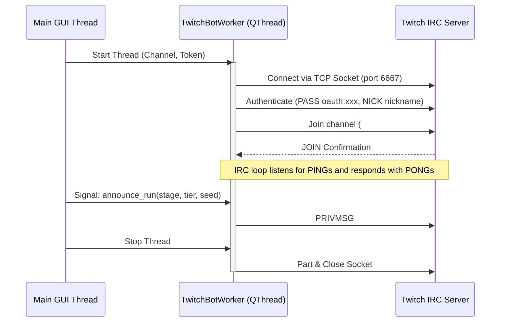

# BonkScanner Developer Wiki - Integrations & Overlays

This page documents the external integration pathways of BonkScanner, detailing the Twitch IRC messaging bot and the OBS local stream overlay HTTP server.

---

## 1. Twitch Chat Bot Integration

Twitch integration enables streamers to announce run milestones (e.g., successful map rerolls with completed tiers or target templates) directly to their Twitch chat.

### Concurrency & Architecture
The integration is split into:
- **`twitch_auth.py`**: Manages credentials, tokens, and OAuth scopes.
- **`twitch_bot.py`**: Runs a background `TwitchBotWorker` thread subclassing PySide6's `QThread`.



### Safety & Resilience Features
1. **PONG Keepalive**: Twitch IRC servers periodically send a `PING :tmi.twitch.tv`. The `TwitchBotWorker` immediately replies with `PONG :tmi.twitch.tv` to prevent disconnection.
2. **Fixed Reconnect Delay**: If the socket is severed while the worker is still marked as running, the bot closes the socket, reports a reconnecting state, and retries after a fixed 2-second delay.

---

## 2. OBS Stream Overlays Server

To provide real-time status displays for stream overlays without taxing screen capture cards, BonkScanner hosts a local web server that outputs transparent HTML widgets.

### Local HTTP Server Details
- **Engine**: Python's native `ThreadingHTTPServer` configured inside `LocalOverlayServer` (defined in [overlay_server.py](../../overlay_server.py)).
- **Port**: Listens on port `17845` (binds to localhost `127.0.0.1`).
- **Assets Source**: Resolves assets folder in `./media/overlay` (or the unpacked PyInstaller bundle `_MEIPASS/media/overlay` directory).

### Supported Routes & Widgets
The server listens for requests starting with `/overlay/` and supports the following widget endpoints:

| Endpoints | Description |
| :--- | :--- |
| `/overlay/stage_summary` | Displays a table outlining elapsed times, kill counts, and items gained per stage. |
| `/overlay/tracked_items` | Renders a grid showing active passive items, their levels, and rarity colors. |
| `/overlay/stats` | Shows real-time player statistics (Damage, Speed, Cooldown, Crit). |
| `/overlay/banishes` | Lists items currently banished in the active run. |
| `/api/overlay-state` | Returns the raw state store in JSON format (polled by widget frontends). |

### Thread-Safe State Store
Because HTTP request handlers run on separate socket threads, the server utilizes a thread-safe `OverlayStateStore` class:
- Access to the state dictionary is protected by a `threading.Lock()`.
- Updates from the main thread use `set_state(state)` (acquiring the lock and copying state variables).
- The request handler uses `get_state()` to retrieve a thread-safe snapshot of the state to serve JSON queries.

### OBS Cache Prevention
To ensure widgets update immediately after a game restart, all server responses contain strict cache-control headers:
```http
Cache-Control: no-cache, no-store, must-revalidate
Pragma: no-cache
Expires: 0
```

---

## Navigation

- Back to Home: [Home Wiki](./Home.md)
- Back to Recordings: [Recordings & VODs Wiki](./Recordings_and_VODs.md)
- Next up: [Settings & Hooks Wiki](./Settings_and_Hooks.md)
