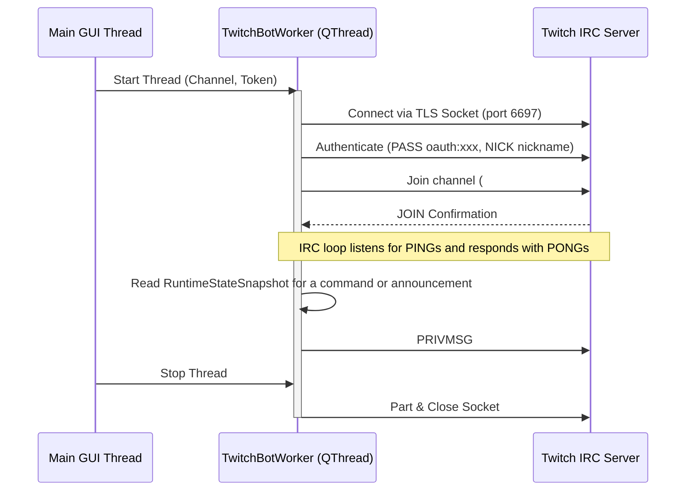

# BonkScanner Developer Wiki - Integrations & Overlays

This page documents the external integration pathways of BonkScanner, detailing the Twitch IRC messaging bot and the OBS local stream overlay HTTP server.

---

## 1. Twitch Chat Bot Integration

Twitch integration lets viewers request live run data and lets streamers opt in
to automatic announcements such as stage transitions and The One Ring pickups.

### Concurrency & Architecture
The integration is split into:
- **`src/twitch_auth.py`**: Manages credentials, tokens, and OAuth scopes.
- **`src/twitch_bot.py`**: Runs a background `TwitchBotWorker` thread subclassing PySide6's `QThread`.


```mermaid
sequenceDiagram
    participant GUI as Main GUI Thread
    participant Bot as TwitchBotWorker (QThread)
    participant IRC as Twitch IRC Server

    GUI->>Bot: Start Thread (Channel, Token)
    activate Bot
    Bot->>IRC: Connect via TLS Socket (port 6697)
    Bot->>IRC: Authenticate (PASS oauth:xxx, NICK nickname)
    Bot->>IRC: Join channel (#streamer)
    IRC-->>Bot: JOIN Confirmation

    Note over Bot, IRC: IRC loop listens for PINGs and responds with PONGs

    Bot->>Bot: Read RuntimeStateSnapshot for a command or announcement
    Bot->>IRC: PRIVMSG #streamer :Response or announcement

    GUI->>Bot: Stop Thread
    Bot->>IRC: Part & Close Socket
    deactivate Bot
```

### Safety & Resilience Features
1. **PONG Keepalive**: Twitch IRC servers periodically send a `PING :tmi.twitch.tv`. The `TwitchBotWorker` immediately replies with `PONG :tmi.twitch.tv` to prevent disconnection.
2. **TLS and Fixed Reconnect Delay**: The worker connects to
   `irc.chat.twitch.tv:6697` through the default TLS context. If the socket is
   severed while the worker is still running, it closes the socket, reports a
   reconnecting state and retries after a fixed 2-second delay.
3. **Snapshot-only game data:** The bot does not read game memory. Commands and
   announcers consume the runtime snapshot supplied by the application.
4. **The One Ring announcer:** This opt-in checkbox is off by default. It
   watches the fast 1-second passive inventory, announces the first observed
   pickup and later duplicates from separate phrase pools, and works on every
   map. A bot connected mid-run seeds its count and does not announce an old
   pickup.

### Supported Chat Commands

| Command | Aliases | Description |
| :--- | :--- | :--- |
| `!stats` | `!bonkstats` | Current player statistics (damage, speed, luck, etc.). |
| `!session` | — | Session stats: resets, found target seeds, tracked item totals. |
| `!bans` | `!banishes` | Currently banished items. |
| `!disabled` | — | Items disabled in game lobby settings. |
| `!items` | `!tracked` | Collected passive items sorted by rarity. |
| `!weapons` | — | Weapons list and isolated upgrade modifiers. |
| `!tomes` | — | Active tomes and bonuses. |
| `!chaos` | `!chaostome` | Chaos Tome level and stat rolls sum. |
| `!dice` | — | Dice passive status, level, attributed effects and ambiguity/pending state. |
| `!shrines` | — | Charge Shrine progress and attributed reward modifiers. |
| `!stages` | — | Stage summary (time and kills per stage). |
| `!powerups` | — | Active powerups and remaining durations. |
| `!kps` | — | Current and rolling average kill rates. |
| `!build` | — | Active build checklist and missing requirements. |
| `!luck` | — | Rarity drop probabilities based on current Luck. |
| `!chests` | `!chest` | Chest counts, keys, and free chest opening metrics. |
| `!presets` | `!preset` | Active search templates or score tier rules. |
| `!scanner` | — | App info and download link. |
| `!bonkhelp` | `!bonkcmds`, `!bonkcommands`, `!bhelp` | List of enabled bot commands. |

---

## 2. OBS Stream Overlays Server

To provide real-time status displays for stream overlays without taxing screen capture cards, BonkScanner hosts a local web server that outputs transparent HTML widgets.

### Local HTTP Server Details
- **Engine**: Python's native `ThreadingHTTPServer` configured inside `LocalOverlayServer` (defined in [src/infra/overlay_server.py](../../src/infra/overlay_server.py)).
- **Port**: Listens on port `17845` (binds to localhost `127.0.0.1`).
- **Assets Source**: Resolves assets folder in `./src/media/overlay` (or the unpacked PyInstaller bundle `_MEIPASS/media/overlay` directory).

### Supported Routes & Widgets
The server listens for requests starting with `/overlay/` and supports the following widget endpoints:

| Endpoints | Description |
| :--- | :--- |
| `/overlay/stage_summary` | Displays a table outlining elapsed times, kill counts, and items gained per stage. |
| `/overlay/tracked_items` | Renders a grid showing active passive items, their levels, and rarity colors. |
| `/overlay/stats` | Shows real-time player statistics (Damage, Speed, Cooldown, Crit). |
| `/overlay/banishes` | Lists items currently banished in the active run. |
| `/overlay/kps` | Displays selected KPS metrics. |
| `/overlay/luck_rarity` | Displays item rarity percentage bars and expected chest counts. |
| `/overlay/build_progression` | Renders the active build progression checklist and requirement deadlines. |
| `/api/overlay-state` | Returns the raw state store in JSON format (polled by widget frontends). |
| `/api/overlay-widget-revision?after=N` | Long-polls editor-visible widget configuration revision changes. |

The editor also POSTs persisted widget geometry to
`/api/save-widget-positions` and canvas dimensions to
`/api/save-canvas-resolution`.

### Thread-Safe State Store
Because HTTP request handlers run on separate socket threads, the server utilizes a thread-safe `OverlayStateStore` class:
- Access to state and widget revisions is protected by a
  `threading.Condition()` so revision waiters can be notified.
- Updates from the main thread use `set_state(state)` (acquiring the lock and copying state variables).
- The request handler uses `get_state()` to retrieve a thread-safe snapshot of the state to serve JSON queries.
- `src/projections/obs.py` builds the payload from `RuntimeStateSnapshot`; the
  browser renderer receives finished values, including model-supplied rarity
  colours, and does not reimplement game rules.

### OBS Cache Prevention
State, revision, asset and error responses disable caching with:
```http
Cache-Control: no-store
```

---

## Navigation

- Back to Home: [Home Wiki](./Home.md)
- Back to Recordings: [Recordings & VODs Wiki](./Recordings_and_VODs.md)
- Learn about In-Game Desktop Overlay: [In-Game Overlay Wiki](./In_Game_Overlay.md)
- Next up: [Troubleshooting & Diagnostics Wiki](./Troubleshooting_and_Diagnostics.md)
