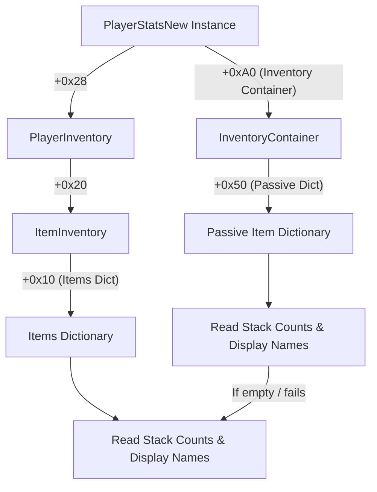

# BonkScanner Developer Wiki - Memory & Live Stats

This page documents the low-level memory inspection architecture of BonkScanner. It details the process memory hook, key static offsets in the game DLL, the algorithm used to parse Mono/Unity dictionaries, passive item lookup paths, and weapon upgrade stat extraction.

---

## Process Access & Memory Reading

Memory reading is handled by the `ProcessMemory` class in [src/memory.py](../../src/memory.py). It uses native Windows APIs to hook into the game process:
- `OpenProcess` with permissions `PROCESS_VM_READ | PROCESS_QUERY_INFORMATION`.
- `ReadProcessMemory` to read raw bytes from the virtual address space of the process.

The memory reader target is `GameAssembly.dll` (a compiled Unity IL2CPP runtime library).

---

## Static Type Info & Field Offsets

To access the dynamic state of the game, BonkScanner references static class fields via compile-time offsets of IL2CPP metadata pointers:

| Target Class / Offset Name | Offset Address | Description / Usage |
| :--- | :---: | :--- |
| `GAME_MANAGER_TYPE_INFO_OFFSET` | `0x2F9C1C0` | Static pointer to `GameManager` instance. |
| `MAP_CONTROLLER_TYPE_INFO_OFFSET` | `0x2F58E08` | Accesses the active map, stage, configuration, and reset indicators. |
| `MAP_GENERATION_CONTROLLER_TYPE_INFO` | `0x2F59000` | Checks whether the map is currently being generated and gets the seed. |
| `MY_TIME_TYPE_INFO_OFFSET` | `0x2F62398` | Gets run time and stage timers. |
| `PLAYER_MOVEMENT_TYPE_INFO_OFFSET` | `0x2F6D670` | Resolves the primary player instance. |
| `MUSIC_CONTROLLER_TYPE_INFO_OFFSET` | `0x2F617C8` | Detects current soundtrack playing (identifies main menu vs. in-game). |
| `CLASS_STATIC_FIELDS_OFFSET` | `0xB8` | The standard offset from a class pointer to its static fields array. |

---

## Traversing Mono/Unity Dictionaries

The game stores inventories, templates, and player stats in standard C# `System.Collections.Generic.Dictionary<K, V>` structures compiled via IL2CPP. The memory layout of these dictionaries is traversed using the following offsets:

```
[Dictionary Instance Address]
  +0x18 --> [Entries Array Pointer] (DICT_ENTRIES_OFFSET)
  +0x20 --> [Count (i32)] (DICT_COUNT_OFFSET)

[Entries Array Pointer]
  +0x20 + (index * 0x18) --> [Individual Entry]
                              +0x8  --> [Key Pointer] (DICT_ENTRY_KEY_OFFSET)
                              +0x10 --> [Value Pointer] (DICT_ENTRY_VALUE_OFFSET)
```

### Traverse Algorithm (Pseudo-Code)
```python
entries_ptr = read_ptr(dict_address + 0x18)
count = read_i32(dict_address + 0x20)

for index in range(min(count, MAX_ENTRIES)):
    entry_addr = entries_ptr + 0x20 + (index * 0x18)
    key_ptr = read_ptr(entry_addr + 0x8)
    val_ptr = read_ptr(entry_addr + 0x10)

    # Process key and value according to their expected types
```

---

## Passive Items: Dual Lookups & Fallbacks

Live passive item inspection requires resolving character inventory items. Because external mods or game patches can store items in different locations, BonkScanner implements a dual-path lookup:



### Why the Fallback Exists
Modded items or items added by external tools during gameplay often fail to register in the primary `PassiveItem` dictionary, but they are guaranteed to exist in the `PlayerInventory.ItemInventory` lookup dictionary.

### Stack Counting Rules
Item counts represent total acquired items, not just unique items.
- Item stack size is read from `item_instance + 0x18` (`ITEM_STACK_COUNT_OFFSET`).
- If a player holds `Wrench x3`, it is counted as **3 items** towards the total inventory count.

### Display Sorting
Inventory list widgets support three stable sorting priorities:
1. **Default:** Preserves the insertion order (memory array indexing).
2. **Rarity High to Low:** Highest rarity items (Legendary, Epic) bubble to the top.
3. **Rarity Low to High:** Lowest rarity items (Common, Rare) bubble to the top.
*Note: The sorting algorithm uses Python's stable Timsort, ensuring that items with identical rarities retain their original insertion order.*

---

## Weapons & Upgrades Data

Weapons are read through `PlayerStatsNew -> PlayerInventory -> WeaponInventory`.

### Weapon Entry Structure
Each weapon object contains:
- `weapon_id` and display name (resolved at offset `+0x50`).
- Weapon level (`+0x20`).
- Absolute weapon stats dictionary (`+0x28`).
- Weapon upgrade modifier array (`+0xD8` -> `+0x18`).

### Upgrade-Only Stats Rule
To show a weapon's progression, the UI defaults to displaying **Upgraded Stats** rather than full active weapon stats.
* **Why:** Full active weapon stats are modified globally by character stats (such as character damage, size, cooldown speed). Showing full stats would incorrectly attribute global character buffs to weapon levels. Upgraded stats isolate only modifications added directly by level-up cards.

---

## Navigation

- Back to Home: [Home Wiki](./Home.md)
- Back to Scanner: [Scanner & Evaluation Wiki](./Scanner_and_Evaluation.md)
- Next up: [Stage Summary Transitions Wiki](./Stage_Summary_Transitions.md)