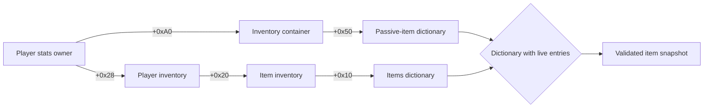

# BonkScanner Developer Wiki - Memory & Live Stats

This page documents the production game-memory paths used by BonkScanner. The
clients described here are read-only: they inspect `Megabonk.exe` and do not
write values into the game. Restart input and the optional native restart hook
are separate run-control concerns.

The constants in this page describe the currently supported game build. IL2CPP
RVAs and field layouts are version-sensitive; the source files are always the
authoritative values after a game update.

---

## Low-Level Process Access

[`ProcessMemory`](../../src/infra/memory/reader.py) is the only production
backend used by the three memory clients. It:

- opens the configured process through `pymem`;
- resolves module-relative addresses against `GameAssembly.dll`;
- caches the module base for the lifetime of the current process handle and
  invalidates that cache when the handle changes or closes;
- exposes exact-size `read_bytes`, `read_ptr`, `read_i32`, `read_float` and
  `read_u8` primitives plus bounded Mono/ASCII string readers;
- translates process, module and short-read failures into
  `ProcessNotFoundError`, `ModuleNotFoundError` or `MemoryReadError`.

All typed reads ultimately pass through `read_bytes`. The string helpers return
`None` for a null pointer, invalid length, undecodable content or failed read;
structural clients decide whether that optional result is acceptable or must
fail the whole logical source.

---

## Production Memory Clients

| Client | What it reads | Main consumers and execution context |
| :--- | :--- | :--- |
| [`GameDataClient`](../../src/infra/memory/game_data_client.py) | Map-generation lifecycle, seed, map/stage identity, game mode, timers and the interactables counter dictionary used for map scoring. | The `Scanner` component reads it from its `BonkScannerWorker` `threading.Thread`. The Live Stats lifecycle and map-context paths use a separate coordinator-owned instance on the application owner thread. |
| [`PlayerStatsClient`](../../src/infra/memory/player_stats_client.py) | Player stats, passive items, weapons, tomes, banishes, disabled-item pool, timers, run counters, damage sources, powerups, item cooldowns, character passives, permanent modifiers, Dice/Chaos attribution and Charge Shrine state. | Demand-driven refresh tasks on the application owner thread. Consumers receive tracker/snapshot projections and do not read memory themselves. |
| [`MapMarkerMemoryClient`](../../src/infra/memory/map_marker_client.py) | Full Map runtime object, viewport transform, map/player/stage identity and the opt-in `currentInteractable` classification path. | [`MapMarkerTracker`](../../src/app/map_marker_tracker.py) on a dedicated single-worker executor. A 25 ms UI timer queues latest-wins work without waiting for the read. |

Each client owns its `ProcessMemory` only when it constructed the backend. Tests
can inject the `MemoryReader` protocol instead, which keeps the domain and
tracker layers independent of `pymem` and Windows.

---

## Key IL2CPP Anchors

These are module-relative RVAs, not absolute addresses. ASLR changes the module
base for each process launch.

| Owner | Constant | Current RVA | Purpose |
| :--- | :--- | :---: | :--- |
| `GameDataClient` | `TYPE_INFO_OFFSET` | `0x2FB5E68` | Interactables status dictionary used for map counters. |
| `GameDataClient` | `GAME_MANAGER_TYPE_INFO_OFFSET` | `0x2F9C1C0` | Playing/game-over lifecycle flags. |
| `GameDataClient` | `MAP_CONTROLLER_TYPE_INFO_OFFSET` | `0x2F58E08` | Current map, stage, raw stage index, final-boss flag and reset state. |
| `GameDataClient` | `MAP_GENERATION_CONTROLLER_TYPE_INFO_OFFSET` | `0x2F59000` | Generation flag and map seed. |
| `GameDataClient` | `MY_TIME_TYPE_INFO_OFFSET` | `0x2F62398` | Pause and run/stage/event clocks. |
| `PlayerStatsClient` | `TYPE_INFO_OFFSET` | `0x2F6A4B8` | Player-stats root and owner. |
| `PlayerStatsClient` | `RUN_STATS_TYPE_INFO_OFFSET` | `0x2F7A170` | Kills, chest counters and damage-source data. |
| `PlayerStatsClient` | `RUN_UNLOCKABLES_TYPE_INFO_OFFSET` | `0x2F7A210` | Active/banished unlockable sets. |
| `PlayerStatsClient` | `ACHIEVEMENT_TRACKER_TYPE_INFO_OFFSET` | `0x2F69FE8` | Total charged-shrine reward budget. |
| `PlayerStatsClient` | `SHRINE_LOGS_TYPE_INFO_OFFSET` | `0x2F81B18` | Exact Charge Shrine modifier log. |
| `MapMarkerMemoryClient` | `MY_PLAYER_TYPE_INFO_OFFSET` | `0x2F620F8` | Player input and current-interactable chain. |
| `MapMarkerMemoryClient` | `UI_MANAGER_TYPE_INFO_OFFSET` | `0x2F9A528` | Pause-map UI hierarchy. |
| `MapMarkerMemoryClient` | `FULL_MAP_UI_TYPE_INFO_OFFSET` | `0x2F9AF30` | Full Map size, display transform and open count. |

All three adapters use `CLASS_STATIC_FIELDS_OFFSET = 0xB8` when resolving the
static-field block of an initialized IL2CPP class. The complete field offsets
and sanity limits remain next to the code that validates them.

---

## Scanner and Runtime Reads

`GameDataClient` intentionally exposes two failure styles:

- ordinary runtime projections tolerate unavailable optional fields and return
  `UNKNOWN`, `None`, zero pointers or empty values where the caller can safely
  represent missing data;
- `wait_for_map_ready()` uses strict reads and fails closed, because treating an
  unreadable `isGenerating` flag as `False` could accept a map while its
  dictionary is being rebuilt.

The map-ready loop polls at 10 ms by default and requires all of the following:

1. generation and reset flags are clear;
2. non-zero current map and stage pointers are present;
3. a generation cycle, seed change, pointer change or last-resort stats change
   proves that a new map was observed;
4. the complete returned counter snapshot and dictionary revision remain stable
   for at least 25 ms.

The interactables dictionary is also guarded by a before/after structural
revision `(entries, count, version)`. A mutation during traversal raises
`MemoryReadError` instead of publishing a mixed old/new map.

---

## Shared Refresh Passes and Cadences

Live Stats memory acquisition is coordinated by
[`RefreshCoordinator`](../../src/app/refresh_coordinator.py),
[`read_sources.py`](../../src/app/read_sources.py) and
[`refresh_tasks.py`](../../src/app/refresh_tasks.py). The application timer only
drives the coordinator; every feature has its own demand predicate and cadence.

One `RefreshTickContext` is created for each driver pass. Logical facts such as
`OWNER_STATS`, `PASSIVE_ITEMS`, `RUN_TIMER`, `MOB_KILLS` and
`MAP_ACTIVITY_VALUES` are resolved at most once in that pass. A second consumer
gets the cached value or the cached exception, so it neither repeats the
physical memory walk nor records the same failure twice. Per-source timing
metadata is also used to reject a torn KPS pair when the run-timer and kill
reads span more than 100 ms.

| Task | Default cadence | Principal memory sources |
| :--- | :---: | :--- |
| Run/recording lifecycle | 1 s physical probe / 1 s recording sync | Runtime state, seed, stage identity and run timer. |
| Full player snapshot | 10 s, retrying startup failure after 1 s | Full stat block, items, weapons, tomes, banishes, disabled pool, damage sources, kills and player level. |
| Passive loot sample | 1 s | Passive items, Luck, banishes, map counters, timed-item cooldowns and optional Size. |
| Combat, powerups and Expected chest inputs | Configurable fast interval, 500 ms by default and never below 100 ms | Run timer + kills, active status effects/timers, chests bought + Key stacks. |
| Event/stage timer | 1 s | Stage timer, normalized stage context and final-boss promotion flag. |
| Charge Shrines | 1 s when demanded | Achievement count, ShrineLogs modifiers and held Wrench stacks. |
| Chaos Tome and character passive attribution | 1 s when demanded | Chaos level, character/passive identity and cached `StatInventory.permanentChanges`. |

The 10-second snapshot remains the durable VOD/recording payload. Faster tasks
publish fresher read-only state to `LiveRunTracker`; UI, Twitch, OBS and in-game
overlay projections consume that state rather than constructing their own
memory clients.

[`PlayerStatsMemory`](../../src/app/player_stats_memory.py) owns the Live Stats
client recovery policy. Three consecutive recognized player-memory failures
close the stale client so the next demanded pass reconnects. The map-activity
game-data source keeps its own failure streak, preventing successful sibling
reads from masking that persistently broken path.

---

## IL2CPP Collections and Snapshot Integrity

The common dictionary header used by the clients is:

```text
[Dictionary]
  +0x18 -> entries array
  +0x20 -> count
  +0x2C -> mutation version

[Entries array]
  +0x20 + index * entry_size -> entry
```

Entry size and key/value layout depend on the concrete generic dictionary. For
the object/object and passive-item dictionaries the common entry size is
`0x18`, with key at `+0x08` and value at `+0x10`; stat dictionaries and
HashSets have their own validated layouts. Never apply the generic pseudo-layout
without checking the constants in the owning client.

Readers bound counts, list sizes, array lengths, transform depth and modifier
counts before walking them. Mutable collections either validate their
pointer/count/version around a walk or cache a layout keyed by those structural
values and re-read the changing values on every sample.

### Passive Items: Dual Paths and Fail-Closed Reads

Passive inventory can be exposed through either route:


```mermaid
flowchart LR
    Stats[Player stats owner]
    Stats -->|+0xA0| Container[Inventory container]
    Container -->|+0x50| Primary[Passive-item dictionary]
    Stats -->|+0x28| PlayerInventory[Player inventory]
    PlayerInventory -->|+0x20| ItemInventory[Item inventory]
    ItemInventory -->|+0x10| Fallback[Items dictionary]
    Primary --> Select{Dictionary with live entries}
    Fallback --> Select
    Select --> Snapshot[Validated item snapshot]
```

The resolver prefers a candidate that actually has entries, not merely the
first non-null pointer. This handles a drained but still allocated dictionary.
If one route fails and the other only appears empty, the read preserves the
failure rather than publishing a false empty inventory.

The complete item walk is deliberately fail-closed:

- stack counts are read twice and must match and remain within the sanity cap;
- a live entry whose ID/name cannot be decoded makes the whole sample
  unavailable;
- any incomplete walk clears the cached layout and raises `MemoryReadError`;
- callers preserve the last confirmed delta baseline, avoiding a false loss
  followed by a phantom pickup when the missing entry reappears.

The cached layout stores item names, stack-count addresses and supported
cooldown slots. Dictionary pointer, entries pointer, count and version are
validated on every pass; stack counts and cooldown values stay fresh.

---

## Player Data Families

`PlayerStatsClient` keeps all pointer traversal at the infrastructure boundary.
Its current public reads cover:

- the full player-stat block plus narrow Luck and Size reads;
- gold, passive inventory, Key count and Expected chest inputs;
- weapons, absolute weapon stats and upgrade-only modifiers;
- tome levels/upgrades and Chaos Tome level;
- banished and disabled items;
- run/stage/game clocks, map stage context, kills, chests and damage sources;
- status-effect-backed powerups and their time bases;
- Bob's Light cooldown data paired with `MyTime.time` from the same task pass;
- character/passive identity, Dice parameters and passive stat modifiers;
- `StatInventory.permanentChanges` with dictionary/list validation and cached
  immutable modifier snapshots;
- Charge Shrine totals and exact logged reward modifiers.

Permanent modifiers are shared by multiple game systems. The memory client
returns validated raw snapshots; `LiveRunTracker` performs source attribution
for Dice, Chaos and Shrines, including partial/ambiguous states and recovery.
This keeps numeric collisions or late attachment from being presented as a
certain source match.

Weapons are resolved through
`PlayerStats -> PlayerInventory -> WeaponInventory`. Weapon level, data ID,
absolute stat dictionary and upgrade modifier list are read separately. The UI
uses upgrade-only values when it needs weapon-level progression, avoiding the
misattribution of global character buffs to a weapon upgrade.

---

## Full Map Marker Reads

Map markers do not use the normal Live Stats refresh pass. The in-game overlay
queues `MapMarkerTracker.tick()` on a single background executor and paints only
the latest completed immutable `MapMarkerSnapshot`.

The memory adapter:

- resolves the current live `FullMap` target from the newest tail of its retained
  multicast delegates; the array length has a corruption cap of 1,000,000 while
  work is bounded to the newest 128 entries;
- derives world size and the physical/Qt viewport from the live Full Map transform;
- combines Full Map, player, stage pointer and raw stage index into a run-scoped
  map identity so stale markers are cleared at boundaries;
- treats an uninitialized IL2CPP TypeInfo token as a normal
  `FullMapNotReadyError`, retaining the process connection for the next poll;
- performs automatic discovery only when the user enables it, sampling the
  game-selected `currentInteractable` at 100 ms and accepting only an explicit
  class allowlist;
- validates an automatically tracked object's class/native pointer and
  class-specific completion fields before keeping its marker active.

Manual placement still needs memory for Full Map projection, but it does not
need automatic discovery. Other marker read failures close the marker client
and retry connection after the tracker backoff instead of painting a fabricated
position.

---

## Navigation

- [Home Wiki](./Home.md)
- [Scanner & Evaluation Wiki](./Scanner_and_Evaluation.md)
- [In-Game Overlay Wiki](./In_Game_Overlay.md)
- [Stage Summary Transitions Wiki](./Stage_Summary_Transitions.md)
- [Troubleshooting & Diagnostics Wiki](./Troubleshooting_and_Diagnostics.md)
