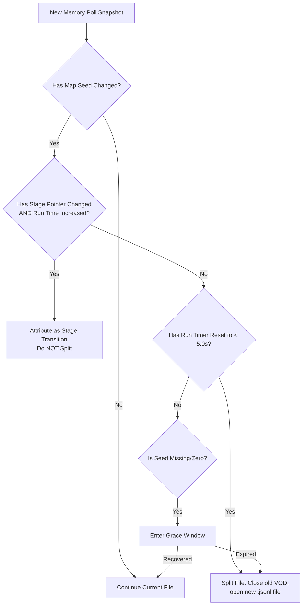

# BonkScanner Developer Wiki - Recordings & VODs

This page documents the serialization schema and file storage mechanisms used by the BonkScanner recording subsystem to persist and replay live run metrics.

---

## Storage & Format

Recordings (VODs) are stored in the `stats_recordings/` directory under the application's executable root.
- **File Format**: JSON Lines (`.jsonl`), where each line is a separate, self-contained JSON object terminated by a newline (`\n`).
- **File Naming**: `YYYY-MM-DD_HH-MM-SS.jsonl` (e.g., `2026-06-22_10-12-00.jsonl`).
- **Flush Strategy**: To avoid data loss due to unexpected process terminations, records are written sequentially and flushed to disk every 3 snapshots.

---

## JSONL Schema Definition (Version 5)

A valid VOD recording consists of three record types written in a specific sequence:
1. **Metadata Record** (First line)
2. **Snapshot Records** (Zero or more subsequent lines)
3. **Summary Record** (Final line upon stopping)

### 1. Metadata Record Schema
Written immediately when recording starts:
```json
{
  "type": "metadata",
  "version": 5,
  "name": "Run 2026-06-22 10:12:00",
  "created_at": "2026-06-22T10:12:00",
  "snapshot_interval_seconds": 30,
  "run_seed": 48291032
}
```

### 2. Snapshot Record Schema
Written periodically (default: every 30 seconds) during active runs:
```json
{
  "type": "snapshot",
  "elapsed_seconds": 60,
  "captured_at": 149204.28,
  "stats": {
    "Damage": { "value": 1.25, "display_value": "+25%" },
    "Armor": { "value": 5.0, "display_value": "5" }
  },
  "items": ["Wrench x2", "Anvil x3"],
  "weapons": [
    {
      "id": 12,
      "level": 4,
      "name": "Fireball",
      "upgraded_stats": { "Damage": 45.0, "Cooldown": -0.4 }
    }
  ],
  "tomes": [],
  "banishes": [],
  "chests_per_minute": 1.2,
  "game_time_seconds": 180.5,
  "mob_kills": 248,
  "player_level": 12,
  "map_seed": 48291032,
  "stage_ptr": 140391290321,
  "stage_time_seconds": 120.4,
  "chests_opened": 3,
  "chests_total": 12,
  "paid_chests": 2,
  "free_chests": 1
}
```

### 3. Summary Record Schema
Written when the user terminates recording:
```json
{
  "type": "summary",
  "duration_seconds": 320,
  "snapshot_count": 10
}
```

The run seed is recorded in the initial metadata record, not duplicated in the summary record.

---

## Auto-Split & Cleanup Heuristics

The recorder (managed in [src/vod_storage.py](../../src/vod_storage.py)) contains safety mechanisms to split files or discard junk records automatically.

### 1. Auto-Split (New Run Detection)
A recording session is split into a new file when a genuinely new run is started, but *must not* split on stage transitions.



### 2. Grace Windows
If the game memory goes temporarily invalid (e.g., during loading screens or main menu transitions), the recorder implements a **20-second grace window** before splitting or auto-stopping. This avoids generating corrupted, fragmented files when the game hangs or is loading.

### 3. Short VOD Cleanup
At stop time:
- If a VOD has **zero snapshots** (often due to immediate cancellation), the file is unlinked (deleted) from disk.
- If a VOD is shorter than the minimum snapshot threshold, it is automatically purged to keep the `stats_recordings/` folder clean.

---

## Navigation

- Back to Home: [Home Wiki](./Home.md)
- Back to Transitions: [Stage Summary Transitions Wiki](./Stage_Summary_Transitions.md)
- Next up: [Integrations & Overlays Wiki](./Integrations_and_Overlay.md)