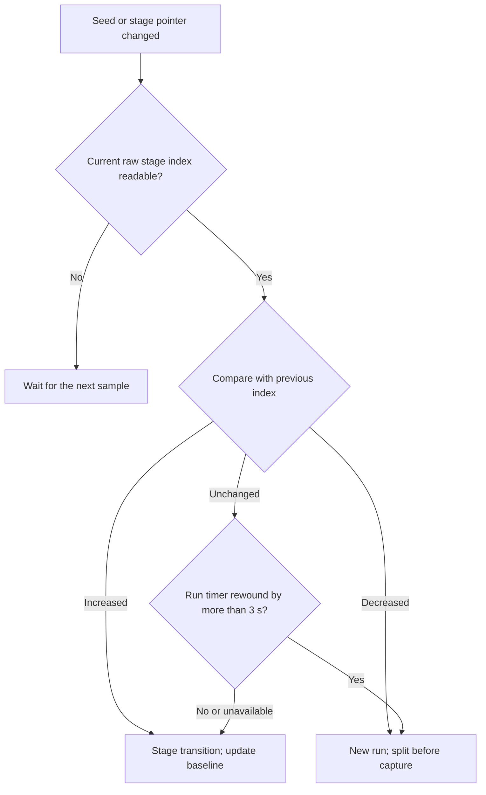

# BonkScanner Developer Wiki - Recordings & VODs

This page documents the JSONL recording format, capture cadence, lifecycle and
cleanup rules used by BonkScanner.

Serialization lives in
[`src/infra/vod_storage.py`](../../src/infra/vod_storage.py). Run detection and
auto-split/stop decisions live in
[`src/app/vod_capture.py`](../../src/app/vod_capture.py).

---

## Storage and Write Policy

Recordings are stored in `stats_recordings/` under the application root. The
legacy `vods/` directory is still read when listing old files.

- File format: UTF-8 JSON Lines (`.jsonl`), one strict JSON object per line.
- File name: timestamp `YYYY-MM-DD_HH-MM-SS.jsonl`, with a uniqueness suffix if
  the timestamp already exists.
- Metadata is written and flushed immediately.
- Snapshots are flushed every 3 records.
- The final summary is flushed when recording stops.
- The default capture interval is 30 seconds. It is clamped to at least 10
  seconds because full player snapshots cannot be produced more often than the
  fixed 10-second memory pass.

The persistent metadata index speeds recording-list display. It is a cache of
the JSONL metadata/summary, not the source of truth; stale entries are reconciled
against file modification time and size.

---

## JSONL Schema (Version 10)

A finalized recording normally contains:

1. one `metadata` record;
2. zero or more `snapshot` records;
3. one `summary` record.

Loaders remain tolerant of older recordings and absent newer optional fields.

### Metadata

```json
{
  "type": "metadata",
  "version": 10,
  "name": "Dicehead 2026-08-30 12:00:00",
  "created_at": "2026-08-30T12:00:00",
  "snapshot_interval_seconds": 30,
  "run_seed": 48291032,
  "character_id": 18,
  "character_name": "Dicehead"
}
```

If no custom name is supplied, the initial automatic name starts with the
character name when available, otherwise `Run`. The JSONL file name itself
remains timestamp-based.

### Snapshot

Every snapshot always writes the basic collections and `chests_per_minute`:

```json
{
  "type": "snapshot",
  "elapsed_seconds": 60,
  "captured_at": 149204.28,
  "stats": {
    "Damage": { "value": 1.25, "display": "+25%" }
  },
  "items": ["Wrench x2", "Anvil x3"],
  "weapons": [],
  "tomes": [],
  "chaos_tome": null,
  "shrines": null,
  "character_passive": null,
  "banishes": [],
  "damage_sources": [],
  "chests_per_minute": 1.2,
  "game_time_seconds": 180.5,
  "mob_kills": 248,
  "stage_index": 1,
  "stage_time_seconds": 120.4
}
```

The serializer adds the following top-level fields only when their values are
available:

- capture-time KPS (`kps_at_capture`, minute, five-minute and run averages);
- `player_level`, `map_seed`, `stage_ptr` and raw zero-based `stage_index`;
- chest totals, Pots total, paid/free counts, Key procs, held Keys and expected
  Key procs;
- per-stage opened/total chest maps;
- actual and expected loot counts by internal rarity key.

Nested weapon, tome, Chaos Tome, Charge Shrine, character-passive and damage
source records are converted by dedicated version-tolerant helpers in
`vod_storage.py`.

### Summary

```json
{
  "type": "summary",
  "name": "Dicehead 12K 2026-08-30 12:00:00",
  "duration_seconds": 320,
  "snapshot_count": 10,
  "mob_kills": 12480
}
```

For an automatic name, stop-time finalization inserts the maximum observed kill
count in compact form. The summary name overrides the initial metadata name
when the recording is loaded. A user-supplied name is preserved.

---

## Lifecycle, Pause and Auto-Split

The recording lifecycle is checked every second from the shared refresh pass:

- `PAUSED_IN_GAME` pauses lifecycle progress without closing the current file;
- returning to `IN_GAME` resumes it;
- `GAME_OVER` or `MAIN_MENU` finalizes the current file and can leave automatic
  recording armed for the next run;
- `UNKNOWN` does not manufacture a stop/split decision;
- a missing seed starts a 20-second grace window; persistent absence then
  auto-stops and disarms recording.

When seed or stage-pointer identity changes, the raw stage index prevents an
ordinary map transition from looking like a new run:


```mermaid
flowchart TD
    Identity[Seed or stage pointer changed] --> Index{Current raw stage index readable?}
    Index -- No --> Wait[Wait for the next sample]
    Index -- Yes --> Compare{Compare with previous index}
    Compare -- Increased --> SameRun[Stage transition; update baseline]
    Compare -- Decreased --> Split[New run; split before capture]
    Compare -- Unchanged --> Timer{Run timer rewound by more than 3 s?}
    Timer -- Yes --> Split
    Timer -- No or unavailable --> SameRun
```

The state that proves a new run already belongs to the new run. Auto-split
therefore stops the old recorder without a final memory capture, starts the new
file, and lets the next capture land only in the new recording.

Interactive/terminal stop otherwise performs a best-effort final full snapshot
before writing the summary. Failure to read that last snapshot does not prevent
the file from being finalized.

---

## Cleanup and Compatibility

At stop time, a file is deleted when its snapshot count is below the configured
minimum. The default minimum is 1, preserving the historical rule that only an
empty recording is discarded. A larger user setting can intentionally discard
short non-empty recordings; empty and short deletions have distinct statuses.

The loader:

- accepts older versions with missing optional fields;
- obtains fast metadata from the first metadata and final summary records when
  possible, falling back to a full scan for incomplete/legacy files;
- ignores malformed files in normal list views rather than breaking the whole
  recordings page;
- shares repeated strings while loading large timelines to reduce memory use.

---

## Navigation

- [Home Wiki](./Home.md)
- [Stage Summary Transitions Wiki](./Stage_Summary_Transitions.md)
- [Integrations & Overlays Wiki](./Integrations_and_Overlay.md)
