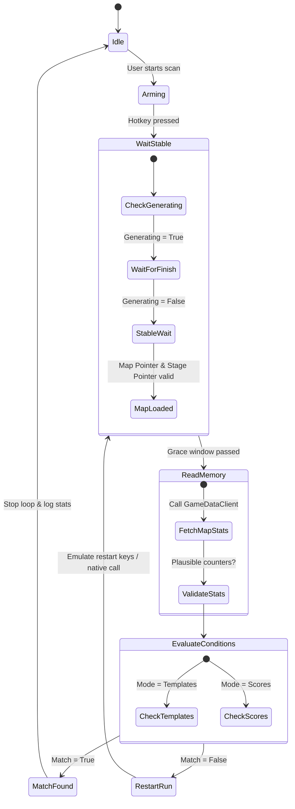

# BonkScanner Developer Wiki - Scanner & Evaluation

This page details the implementation of the Map Scanner Loop and the two evaluation systems used to identify whether a map meets the user's requirements: **Templates** (rules-based matching) and **Scores** (weighted mathematical ranking).

---

## The Scanner Worker Loop

The core scanning process runs on a background `QThread` called `ScannerWorker` (defined in [gui_scanner.py](../../src/gui_scanner.py)). Keeping this in a separate thread prevents the GUI from freezing during continuous memory operations and key emulation.

### Polling State Machine

The scanner loop executes the following sequence:

### Key Safety Mechanisms
1. **Unstable Read Mitigation**: The scanner does not evaluate the map immediately upon loading. It waits for the `MapGenerationState` to flag `is_generating = False` and checks that the memory pointers for both `current_map_ptr` and `current_stage_ptr` are stable and non-zero.
2. **Stable Snapshot Reuse**: If the map-ready wait has already fetched a valid map snapshot, the scanner preserves and evaluates this state, preventing an immediate reread from picking up a transient or partial loading state.

---

## 1. Templates Mode (Rule-Based Matching)

In Templates mode, maps are matched against strict logical thresholds. The evaluation is handled by `find_matching_template` in [logic.py](../../src/logic.py).

### Matching Algorithm
- All templates configured in `config.json` are loaded.
- The templates are sorted in **descending order of their template ID** (`id` field). This ensures that newer or higher-priority templates are matched first.
- For each active template, the following fields are evaluated:
  - `sm_total`: Minimum sum of Shady Guy + Moais (i.e. `shady + moai >= sm_total`).
  - `shady`: Minimum number of Shady Guys required.
  - `moai`: Minimum number of Moai statues required.
  - `micro`: Minimum number of Microwaves required.
  - `boss`: Minimum number of Boss Curses required.
- The first template where **all conditions are met** is returned as the match, stopping the scanner.

---

## 2. Scores Mode (Weighted Evaluation)

Scores mode ranks maps using weights and multipliers to determine which "tier" a generated map belongs to. It is computed in `calculate_score` and `evaluate_map_by_scores` in [logic.py](../../src/logic.py).

### Microwave Normalization
Microwave values in the game memory can occasionally be null or overflow. The value is normalized before scoring:
$$
\text{Normalized Microwaves} =
\begin{cases}
1 & \text{if } v \text{ is None or } v < 1 \\
2 & \text{if } v > 2 \\
v & \text{otherwise}
\end{cases}
$$

### Scoring Formula
The base score is a linear weighted sum of Moais, Shady Guys, Boss Curses, and Magnet Shrines (capped at 2):
$$
\text{Base Score} = (\text{Moais} \times W_{moai}) + (\text{Shady} \times W_{shady}) + (\text{Boss} \times W_{boss}) + (\min(\text{Magnet Shrines}, 2) \times W_{magnet})
$$

Where default weights configured in `config.py` are:
* $W_{moai} = 3.0$
* $W_{shady} = 2.0$
* $W_{boss} = 1.0$
* $W_{magnet} = 0.5$

#### Microwave Multipliers
A multiplier is applied based on the normalized microwave count:
* **1 Microwave:** Multiplier $M_1$ (default $1.0$)
* **2 Microwaves:** Multiplier $M_2$ (default $1.25$)

$$
\text{Final Score} = \text{Base Score} \times \text{Multiplier}
$$

### Tier Classification
Once the final score is calculated, the map is evaluated against enabled tiers in descending order of quality:

| Tier | Minimum Score Threshold (Default) | Additional Hard Requirements |
| :--- | :---: | :--- |
| **Perfect+** | $30.0$ | Normalized Microwaves $\ge 2$ |
| **Perfect** | $25.0$ | Normalized Microwaves $\ge 2$ **OR** (Microwaves $= 1$ AND Shady + Moai $\ge 8$ AND Boss Curses $\ge 2$) |
| **Good** | $20.0$ | None |
| **Light** | $14.0$ | None |

If the map's score exceeds a tier's threshold and satisfies any additional requirements, it is classified as that tier. If that tier is marked as **active** in the user settings, the scan stops.

---

## Session Stats

Session stats track scanner performance. The UI coordinates updates via `MegabonkApp`:
* **Total Rerolls**: Persistent global count stored in `config.json`.
* **Session Rerolls**: Rerolls in the current application run.
* **Rerolls since Last Match**: Rerolls performed since any matching template/tier was found.
* **Average Rerolls per Target**: Running average calculations used to estimate probability.

> [!WARNING]
> **Data Integrity:** When deleting or deactivating a template/tier at runtime, session stats are preserved. Unrelated active templates or tier counters are not cleared, preventing historical session metrics from resetting accidentally.

---

## Navigation

- Back to Home: [Home Wiki](./Home.md)
- Next up: [Memory & Live Stats Wiki](./Memory_and_Live_Stats.md)