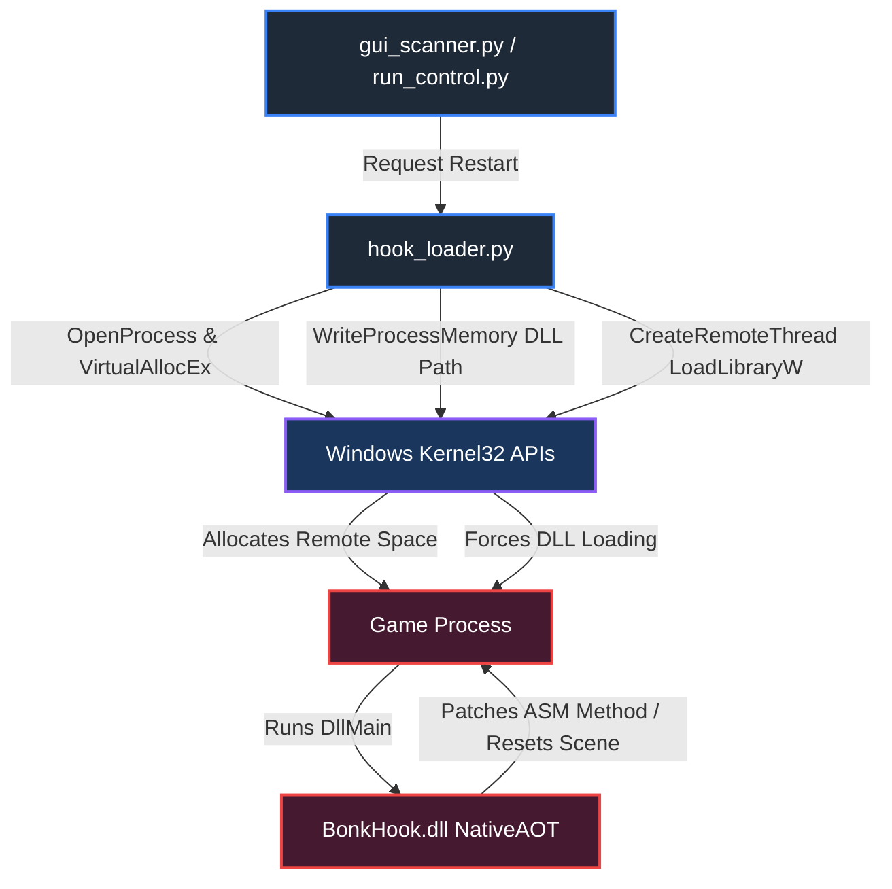

# BonkScanner Developer Wiki - Settings, Hotkeys & Hooks

This page documents the user settings layer, keyboard hotkey management, and the low-level architecture of the native assembly hook restarts.

---

## 1. Settings Configuration

Application settings are loaded and persisted using functions in [config.py](../../config.py) and stored in `config.json` inside the application folder:
- **Default Profiles**: Contains structural profiles for templates and scores.
- **Weights & Tiers**: Stores weight constants ($W_{moai}$, $W_{shady}$, etc.) and active tier thresholds.
- **Skip Versions**: Stores release version hashes that the user opted to ignore in the update checker.
- **Native Hook Options**: Flags whether the native DLL hook is prioritized for resets.

---

## 2. Keyboard Hotkey Management

To operate the scanner without requiring window focus, BonkScanner captures keystrokes globally:
- **Scan-Code Tracking**: Hotkeys are captured using hardware-level scan codes rather than virtual keys. This prevents issues with different keyboard layouts (QWERTY vs. AZERTY).
- **Global Hook**: Listens to system-wide events so hotkeys work while playing the game in fullscreen mode.
- **Active Game Context Filter**: To avoid interfering with standard system typing, gameplay keys (like temporary opacity switches or item locks) are ignored unless the game process window is verified as the current foreground window.

---

## 3. Native Hook Restart (`BonkHook.dll`)

When resetting map generations, traditional keyboard emulation can fail if the game window is alt-tabbed, minimized, or during high CPU workloads. The Native Hook mode provides a direct injection path that calls game methods natively.

### Architecture

### Injection Details (in `hook_loader.py`)
1. **Target**: Binds to the running game process via its PID.
2. **Memory Allocation**: Allocates memory inside the game process's address space using `VirtualAllocEx` with `PAGE_READWRITE` permissions.
3. **DLL Path Write**: Writes the absolute path of `BonkHook.dll` into the allocated memory space using `WriteProcessMemory`.
4. **Execution**: Spawns a thread inside the game process using `CreateRemoteThread` pointing to `LoadLibraryW` in `kernel32.dll`.
5. **Initialization**: Once `LoadLibraryW` completes, the game runs the DLL's main entry point, injecting patches into `GameAssembly.dll`.

### DLL Compilation & Location
- **Location**: `native/BonkHook/bin/Release/net8.0/win-x64/publish/BonkHook.dll`
- **Technology**: Built using Microsoft .NET 8.0 NativeAOT compiler to ensure it runs as a pure unmanaged C/C++ style DLL, removing the requirement to load the full .NET runtime into the game process.

### Advantages of Native Restart
- **Zero Input Dependency**: Does not require window focus or emulate keyboard clicks.
- **Alt-Tab Friendly**: Streamers can browse the web or play other games on separate monitors while the scanner runs and resets the game in the background.
- **Speed**: Reduces reset cycle delay times compared to keyboard macros.

> [!CAUTION]
> **Antivirus Mitigation:** Because the loader utilizes `VirtualAllocEx` and `CreateRemoteThread`, some antivirus engines may flag this action as suspicious. BonkScanner mitigates this by writing the DLL to a dedicated persistent folder rather than temporary paths.

---

## Navigation

- Back to Home: [Home Wiki](./Home.md)
- Back to Integrations: [Integrations & Overlays Wiki](./Integrations_and_Overlay.md)
- Next up: [Troubleshooting & Diagnostics Wiki](./Troubleshooting_and_Diagnostics.md)
