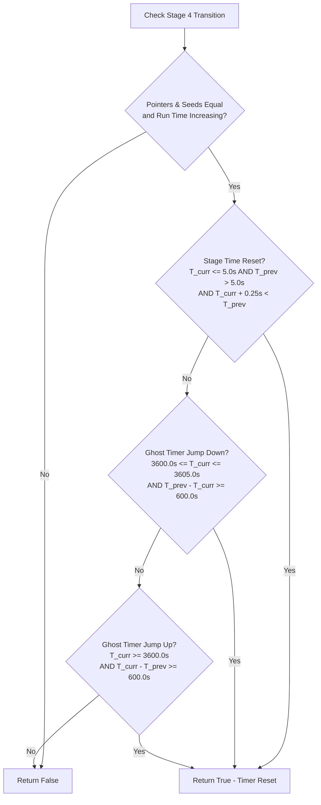

# BonkScanner Developer Wiki - Stage Summary & Transitions

This page documents the algorithm used by BonkScanner to divide a live run or a recorded VOD timeline into separate, distinct **Stages** (Stage 1 to Stage 4), attributing items, elapsed times, and mob kills to each stage.

---

## The Stage Transition Problem
In the game, stage transitions are not marked by explicit event logs. Instead, BonkScanner must reconstruct these boundaries by observing changes in the game's internal memory state:
- **Stages 1-3**: Game pointer or map seed structures change upon entering a new map area.
- **Stage 4**: The game engine typically reuses the Stage 3 pointer and seed. Stage 4 entry must be detected via anomalies or resets in the stage timer.

---

## resolve_next_stage_index Algorithm

Stage transitions are evaluated sequentially for every snapshot using `resolve_next_stage_index` (defined in [run_summary.py](../../src/run_summary.py)):

### 1. Transitions to Stage 2 & Stage 3
If the current stage index is **less than 3**, the index increments to the next stage if:
* **Stage Pointer Change**: Both previous and current snapshots have non-zero stage pointers, and the pointers differ:
  $$\text{previous\_stage\_ptr} \neq \text{current\_stage\_ptr}$$
* **Seed Fallback**: If stage pointers are missing/zero, but both previous and current map seeds are present and differ:
  $$\text{previous\_seed} \neq \text{current\_seed}$$

### 2. Transition to Stage 4 (Timer Heuristics)
If the current stage index is **exactly 3**, BonkScanner evaluates `looks_like_stage_four_transition` to flag the transition to Stage 4.

This checks three scenarios based on the stage timer ($T_{stage}$) and total run timer ($T_{run}$):

#### Transition Flag Conditions:
1. **Timer Reset**: The stage timer restarts near zero.
   * `current_stage_time <= 5.0`
   * `previous_stage_time > 5.0`
   * `current_stage_time + 0.25 < previous_stage_time`
2. **Ghost Timer Jump (Downwards)**: The stage timer jumps backward into a "ghost" stage range (often 3600-3605s).
   * `3600.0 <= current_stage_time <= 3605.0`
   * `previous_stage_time - current_stage_time >= 600.0`
3. **Ghost Timer Jump (Upwards)**: The stage timer jumps forward past 3600 seconds.
   * `current_stage_time >= 3600.0`
   * `current_stage_time - previous_stage_time >= 600.0`

---

## Stage Stat Attribution Logic

### 1. Stage Durations (Time Logic)
- **Stage 1 Normalization**: While later stages calculate duration by subtracting the start time of the stage's first snapshot, **Stage 1 duration** is normalized to start from $0.0$ seconds (even if the first recording snapshot starts several seconds late).
- **Boss Time-Skip Protection**: Stage 1-3 durations are calculated using the global run timer (`game_time_seconds`) rather than the stage timer (`stage_time_seconds`). This prevents in-game boss time-skip mechanics (which cause stage timers to skip forward) from corrupting the actual elapsed duration of the stage.

### 2. Mob Kills Attribution
Kills are calculated using cumulative snapshot totals (`mob_kills`):
- **Transition Boundary Rule**: If the first snapshot of a new stage is captured within the first few seconds of that stage (defined by `PLAYER_STATS_STAGE_TRANSITION_BOUNDARY_SECONDS = 5.0`), this snapshot is used as the **closing boundary** for the previous stage. This prevents kills obtained right before the transition from being omitted due to snapshot polling intervals.
- **Reconciliation**: At the end of calculation, any remaining drift between the sum of stage kills and the final absolute total is resolved by adjusting the kills of the last active stage:
  $$\text{Last Stage Kills} = \text{Last Stage Kills} + (\text{Final Snapshot Total Kills} - \sum \text{Calculated Stage Kills})$$

### 3. Items Gained (Debouncing logic)
Inventory item counts can occasionally drop temporarily due to thread reading race conditions or memory glitches. To avoid creating fake item deltas, a **Debounce Tracker** is implemented in [run_summary.py](../../src/run_summary.py):
- **Pending Drop Streaks**: If an item count decreases, the drop is not immediately committed. It is marked as "pending" for up to 3 snapshots (`PLAYER_STATS_ITEM_DROP_CONFIRMATION_SNAPSHOTS`).
- If the count does not recover within 3 snapshots, the drop is finalized.
- Item counts represent stack differences: if `Wrench x1` upgrades to `Wrench x3` at the transition boundary, $+2$ item counts are attributed to the new stage.

---

## Navigation

- Back to Home: [Home Wiki](./Home.md)
- Back to Memory: [Memory & Live Stats Wiki](./Memory_and_Live_Stats.md)
- Next up: [Recordings & VODs Wiki](./Recordings_and_VODs.md)