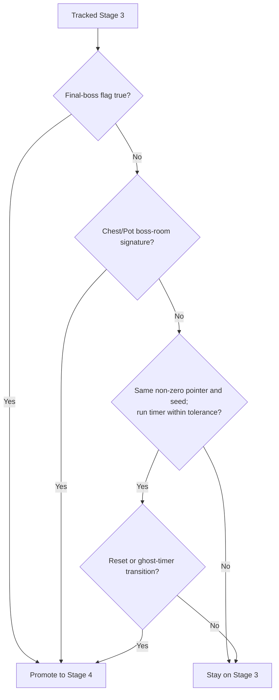

# BonkScanner Developer Wiki - Stage Summary & Transitions

This page documents how BonkScanner maps live or recorded snapshots to the
human-facing Stage 1-4 timeline and attributes time, kills and item gains.

The canonical implementation is
[`src/core/run_summary.py`](../../src/core/run_summary.py). Both Stage Summary
rows and recording-scrubber stage bands use the same `stage_number_sequence()`;
they must not infer stage numbers independently.

---

## Memory Signals

The game exposes a zero-based `MapController.index` for the ordinary maps:

| Raw `stage_index` | User-facing stage |
| :---: | :---: |
| `0` | Stage 1 |
| `1` | Stage 2 |
| `2` | Stage 3 |

The raw value stays at `2` in the Forest/Desert boss room, so Stage 4 needs
additional positive evidence. Snapshots can carry:

- `stage_index`, `stage_ptr` and `map_seed` from `GameDataClient`;
- `is_final_boss_stage`, the game's own atomic MapController flag;
- Chest/Pot map totals used as a fallback boss-room signature;
- stage and run timers used only as the final heuristic fallback.

Missing data never demotes an already resolved stage. The sequence is clamped
to move forward from 1 through 4.

---

## Initial Stage and Ordinary Transitions

`resolve_initial_stage_index()` first normalizes the raw index. A late attach
with raw Stage 3 is promoted directly to Stage 4 when the final-boss flag or map
activity signature is already present.

For later snapshots `resolve_next_stage_index()` uses this order:

1. A raw transition from Stage 2 to Stage 3 is authoritative.
2. Any available raw index updates the tracked Stage 1-3 value.
3. Only when the raw index is unavailable, a changed non-zero stage pointer can
   advance Stage 1/2. If both pointers are absent, a seed change is the fallback.
4. A tracked Stage 3 can advance to Stage 4 through one of the positive signals
   below.

Late attachment in Stage 2 or 3 can reconstruct the observed stage start from
the run timer minus the stage timer. This is allowed only inside the known stage
durations (540 seconds for Stage 2 and 480 seconds for Stage 3); ambiguous boss
overtime is not backfilled.

---

## Stage 4 Promotion

The strongest signal is `MapController.isFinalBossStage`. When it is unavailable
or false, two fallbacks remain:

1. **Map activity signature:** while raw Stage 3 is active, `chests_total < 46`
   or `pots_total < 55` is treated as the boss-room wipe signature.
2. **Timer transition:** `looks_like_stage_four_transition()` requires the same
   non-zero stage pointer and seed on both snapshots, available timers and no
   run-timer rewind larger than the 3-second tolerance. It then accepts one of:

   - the stage timer falls to at most 90 seconds from a value above 5 seconds,
     with a drop larger than 3 seconds;
   - the timer falls into the 500-900 second ghost range by at least 300 seconds;
   - the timer jumps upward past 500 seconds by at least 300 seconds.

```mermaid
flowchart TD
    Start[Tracked Stage 3] --> Flag{Final-boss flag true?}
    Flag -- Yes --> Stage4[Promote to Stage 4]
    Flag -- No --> Activity{Chest/Pot boss-room signature?}
    Activity -- Yes --> Stage4
    Activity -- No --> Stable{Same non-zero pointer and seed;<br>run timer within tolerance?}
    Stable -- No --> Stay[Stay on Stage 3]
    Stable -- Yes --> Timer{Reset or ghost-timer transition?}
    Timer -- Yes --> Stage4
    Timer -- No --> Stay
```

All fallbacks are positive-only. A failed flag/activity read is not proof that
the run is outside the boss room.

---

## Time and Kill Attribution

- Stage 1 duration is normalized to run time `0.0`, even if recording began a
  few seconds late.
- Stage 2/3 late-attach duration can use the safe inference described above.
- Durations use the global run timer rather than the stage timer, avoiding boss
  time-skip/ghost-timer distortion.
- A first snapshot in the new stage closes the previous stage when its stage
  time is within 5 seconds, or when the raw index explicitly advanced. That
  same closing decision is used for time, kills and item gains.
- Kill totals use cumulative `mob_kills` with a per-stage baseline. Final drift
  is reconciled into the last known stage only when the earlier rows are
  sufficiently complete to do so safely.

---

## Item Gain Integrity

Stage item totals use stack deltas grouped by rarity. The tracker does not trust
a single temporary decrease:

- a decrease becomes pending;
- it is committed only after **2 consecutive readable snapshots**
  (`PLAYER_STATS_ITEM_DROP_CONFIRMATION_SNAPSHOTS = 2`);
- recovery before confirmation cancels the pending drop;
- an unavailable item sample does not become an empty inventory or advance the
  decrease streak;
- a closing transition snapshot credits its gains to the stage it closes.

The underlying `PlayerStatsClient` also fails an incomplete dictionary walk as a
whole, so torn memory reads do not enter this debounce layer as plausible data.

---

## Navigation

- [Home Wiki](./Home.md)
- [Memory & Live Stats Wiki](./Memory_and_Live_Stats.md)
- [Recordings & VODs Wiki](./Recordings_and_VODs.md)
