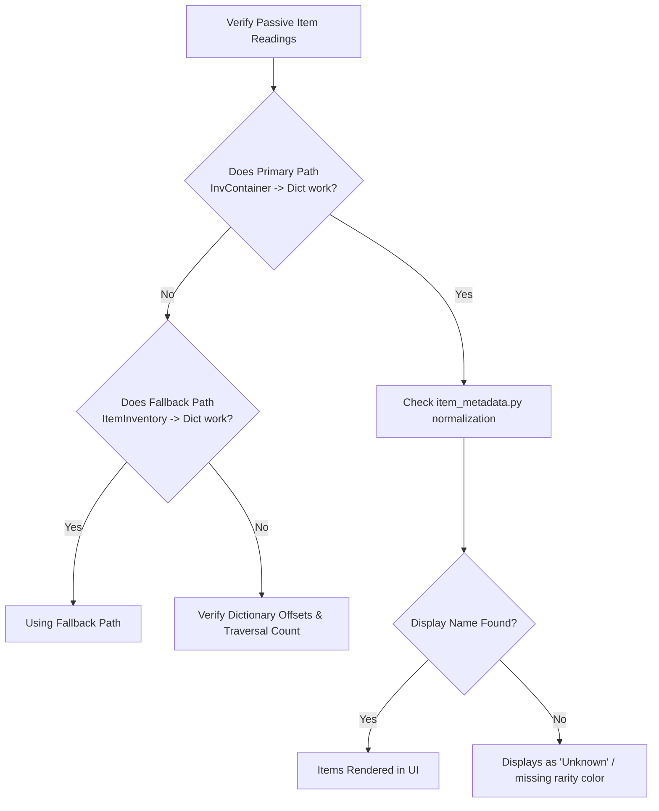

# BonkScanner Developer Wiki - Troubleshooting & Diagnostics

This page outlines common troubleshooting procedures for debugging BonkScanner's memory polling loops, live stat extraction, recording splits, and integrations, followed by suggested future improvements.

---

## Diagnostics Flowcharts & Checklists

### 1. Map Scanner Resets Map Incorrectly
If the scanner loop skips matching maps or loops endlessly:
* **Stability Grace Period**: Ensure that `GameDataClient` is waiting until `is_generating` returns `False`. If the scanner evaluates during the loading screen, stats will read as empty ($0$), triggering a restart.
* **Active Filter Refresh**: Verify whether the user updated templates or scores *during* the scan session. Check that the UI correctly synchronized settings without resetting active session stats.
* **Restart Mode Bitness**: If using Native Hook restart, ensure the game is the x64 version. If using Keyboard mode, verify that the game window has input focus.

### 2. Live Stats Panels are Blank
If all labels in the Player Stats UI remain as `--` or default values:
* **Base Pointer Validation**: Verify if `PlayerStatsNew` resolves in memory. If the base address resolves as `0x0`, the game is in the main menu or currently loading.
* **Local vs. Total Failure**: Check if basic stats (Damage, Speed) fail to load, or if only inventories fail. If basic stats work but passive items are missing, the issue is restricted to inventory dictionary traversal.

### 3. Passive Items are Missing
If items are equipped in-game but do not show up in the live stats grid:

### 4. VOD Recording Splits Incorrectly
If one continuous run generates multiple `.jsonl` files, or if two separate runs merge into one file:
* **Timer Check**: Verify if `game_time_seconds` has reset to near $0.0$.
* **Transition Boundary Conflict**: Check if the stage pointer changed while the run timer continued. If yes, the auto-split engine correctly attributes this to a stage transition, not a new run.
* **Grace Window Duration**: If the game lags during loading screens, the map seed might read as invalid. Ensure the grace window (default 20 seconds) is active before closing the recording stream.

### 5. OBS Overlay Doesn't Load
* **Port Collision**: Run `netstat -ano | findstr 17845` in PowerShell to verify if another application is binding to the overlay port.
* **Asset Integrity**: Ensure the folder [media/overlay/](../../media/overlay/) exists and is populated with `index.html`, CSS, and JS scripts.

---

## Suggested Future Improvements

Developers can build on the current architecture with these recommended features:

1. **Persistent Sort State**: Add a `default_sort_mode` string parameter to `config.json` so that the user's item sorting preference (`Rarity High to Low`, `Rarity Low to High`, or `Default`) survives application restarts.
2. **Snapshot Metadata Debug Panel**: Create a developer-only UI view displaying raw metadata (`stage_ptr`, `map_seed`, `stage_time_seconds`) in real-time, helping debug new game patches.
3. **CLI Recording Analyzer**: Build a standalone python script (e.g. `tools/analyze_recording.py`) that reads a `.jsonl` VOD and prints a formatted CLI summary of stage transitions, item acquisition boundaries, and kill logs.
4. **Fallback UI Hints**: Display a subtle badge (e.g. `[F]`) next to items loaded from the `ItemInventory` fallback path, alerting developers of memory reading bypasses.
5. **Item Density Analysis**: Display both the **Total Items count** (sum of stack sizes) and **Unique Items count** (number of filled inventory slots) to help players calculate build density.

---

## Navigation

- Back to Home: [Home Wiki](./Home.md)
- Back to Hooks: [Settings & Hooks Wiki](./Settings_and_Hooks.md)
